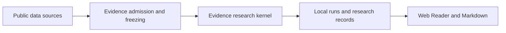

[简体中文](README.md) | English

# TradingAgents

A local multi-agent research workbench for China A-shares, derived from [TauricResearch/TradingAgents](https://github.com/TauricResearch/TradingAgents). It turns company profiles, disclosures, financials and prices into reviewable research records, helping researchers identify **key evidence, the main doubts and what to verify next**.

Supports company research, catalyst research, holding review and batch company research. The Web workbench is the maintained entry. It does not generate orders or target positions, or provide investment advice.

[](https://david188888.github.io/videos/tradingagents-demo-20261008.mp4)

24-second demo with English narration and captions, showing a saved historical research sample (2026-10-06) in the current Reader. Click the poster to play.

## Project highlights

- **A-share evidence chain**: combines public company information, official disclosures, financials and prices while preserving sources, timestamps and coverage limits.
- **Purposeful Agent roles**: operating, event and market specialists develop isolated hypotheses for challenge and synthesis; code owns evidence admission, reference validation and deterministic calculations.
- **Traceable research reading**: follow judgments back to evidence, doubts and Agent outputs. Reader and Markdown share the same saved record; reading does not fetch data or invoke models.

## Overall architecture and Agent design



| Role / layer | Responsibility |
| --- | --- |
| Operating, event and market specialist Agents | Propose hypotheses and invalidation conditions from their own evidence views, without reading other specialists' drafts. |
| Independent challenge Agent | Identify counterevidence, evidence gaps and conditions to check. |
| Synthesis Agent | Combine evidence and challenges into dimension-level judgments, key doubts and next steps. |
| Code host | Control source admission and execution boundaries, check computable conditions, validate and persist results. |

Baseline research completes independently and is saved before an optional response to the user's focus; that response cannot rewrite baseline conclusions. Execution, recovery and module boundaries are detailed in the [architecture](ARCHITECTURE.md).

## Quick start

Requires Python 3.10+ and an API key for your chosen model provider. The default model is DeepSeek V4.1 Flash (`deepseek-flash`).

```bash
git clone https://github.com/david188888/TradingAgents.git
cd TradingAgents
python3 -m venv .venv
source .venv/bin/activate
pip install -e ".[china,web]"

cp .env.example .env
# Set DEEPSEEK_API_KEY in .env, or configure another model provider.

tradingagents web --port 8765 --open
```

Web binds only to `127.0.0.1`, includes its frontend and needs no Node.js at runtime. Run records live under `~/.tradingagents/`. Keep credentials in ignored local configuration. Data entitlements and configuration are described in [.env.example](.env.example) and [Web operations](docs/operations/evidence-research.md).

## Current limitations

- **Limited coverage**: public sources may be missing, rate-limited or unable to establish historical availability. Some calendar and historical valuation capabilities require Tushare credentials and entitlements.
- **Research quality needs evaluation**: completed runs may remain `partial / LOW_CONFIDENCE`. Passing evidence checks does not establish economic causes or fair value, and improved predictive accuracy has not been demonstrated.
- **Defined product scope**: maintained research runs through the local A-share Web workbench. CLI analysis is no longer maintained; older workflows retain saved reading and compatible recovery.

## Explore further

| Question | Documentation entry |
| --- | --- |
| Architecture, module ownership and Agent boundaries | [ARCHITECTURE.md](ARCHITECTURE.md) |
| Operations, sources, models and recovery | [Web operations](docs/operations/evidence-research.md) · [Model configuration](docs/operations/llm-reasoning.md) |
| Research records and evidence contracts | [Contract index](docs/contracts/README.md) · [Research record](docs/contracts/research-record.md) |
| Reader evidence tracing and presentation | [Reader architecture](docs/architecture/research-reader.md) |
| Coding Agent and contributor workflow | [AGENTS.md](AGENTS.md) · [CONTRIBUTING.md](CONTRIBUTING.md) |
| All documentation and release records | [Documentation index](docs/README.md) · [3.1 release notes](docs/reviews/2026-10-07-v3.1-release-notes.md) |

Coding Agents should start with [AGENTS.md](AGENTS.md). Code, contracts and current-state docs define supported behavior; historical plans are not implementation evidence.


## Acknowledgments and license

Thanks to [TauricResearch](https://github.com/TauricResearch/TradingAgents) for the multi-agent foundation, [Simon Lin](https://github.com/simonlin1212/a-stock-data) for the A-share data reference, and the data-service and open-source maintainers. This fork develops the evidence research and local workbench design described above on that foundation. See [LICENSE](LICENSE).
