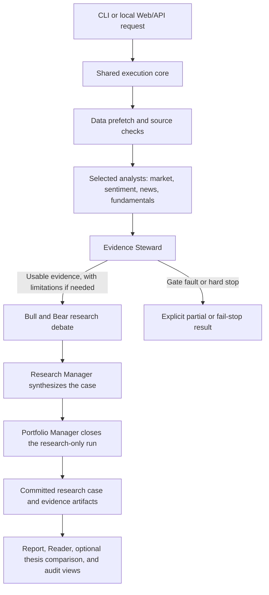

English | [简体中文](README.zh-CN.md)

# TradingAgents

TradingAgents is a local, LangGraph-based multi-agent research framework built on [TauricResearch/TradingAgents](https://github.com/TauricResearch/TradingAgents). This fork focuses on China A-shares: it gathers market, sentiment, news, and company evidence; checks its quality; tests opposing theses; and publishes a reviewable research case. A CLI and a local web workbench share the same execution core. The output supports company research and holding review, not orders, target positions, or investment advice.

## Demo

Watch a 20-second walkthrough of a completed A-share research-only sample. English annotations guide the original Chinese interface; the video is for research demonstration only, not investment advice.

[](https://david188888.github.io/videos/tradingagents-demo.mp4)

[Open the 20-second demo video](https://david188888.github.io/videos/tradingagents-demo.mp4) · [View the project page](https://david188888.github.io/en/projects/tradingagents/)

## Research pipeline

The CLI and web workbench turn a typed request into the same LangGraph run. The public modes are `company_research` and `holding_review`; the CLI starts company research, while holding review requires context supplied through the Web/API. The graph runs selected analysts in order after deterministic data prefetch, then checks the evidence before debate.



The Evidence Steward distinguishes `PASS`, `LOW_CONFIDENCE`, and `FAIL_STOP`; an unexpected gate fault also terminates the graph. A completed run may still expose unknowns or partial coverage. Research artifacts are published from committed run state, and the Reader/Audit views show persisted results rather than fetching new evidence. The former Trader and three-role risk debate are retired from the current execution graph. See [the architecture map](ARCHITECTURE.md) for the execution and persistence boundaries.

## Data and agents

Provider routing is local to `tradingagents/dataflows/`. The table names representative interfaces, not a promise that every provider is available for every ticker or date. Provider failures and incomplete coverage are reported explicitly.

| Evidence | Representative interfaces | Current sources |
| --- | --- | --- |
| Prices and indicators | `get_stock_data`, `get_adjusted_price_history`, `get_indicators` | A-share routing can use mootdx, Tushare, and AKShare according to the requested capability and configuration; indicators can be computed locally. |
| Company financials and valuation | `get_fundamentals`, `get_balance_sheet`, `get_cashflow`, `get_income_statement`, `get_a_share_valuation` | Tushare and Sina for financials; Tencent for current A-share valuation snapshots. |
| News and disclosures | `get_news`, `get_a_share_cninfo_announcements`, `get_a_share_exchange_announcements` | Configured search/news providers and official CNINFO or exchange disclosures; EastMoney is a labeled public fallback for some queries. |
| A-share research supplements | `get_a_share_dragon_tiger`, `get_a_share_lockup_releases`, `get_a_share_adjust_factors`, `get_a_share_valuation_history`, `get_china_pmi` | EastMoney, Sina, baostock, and the National Bureau of Statistics, depending on the interface. |

Some supplemental A-share adapters were informed by [Simon Lin's a-stock-data](https://github.com/simonlin1212/a-stock-data), including adjustment factors, historical valuation, listing history, chip distribution, and macro series. They are implemented and routed in this repository; installing the entire a-stock-data toolkit is not a runtime requirement. See [A-share data capabilities](docs/operations/a-share-data-capabilities.md) for source and fallback details.

| Agent or stage | Main responsibility |
| --- | --- |
| Market Analyst | Examines price action, indicators, and market structure. |
| Sentiment Analyst | Assesses attention and sentiment in available news and social sources. |
| News Analyst | Interprets company news, disclosures, and potential catalysts. |
| Fundamentals Analyst | Reviews financial statements, valuation, and business quality. |
| Evidence Steward | Checks coverage, contradictions, and provenance; records evidence limits before debate. |
| Bull Researcher | Builds the strongest evidence-bound positive thesis. |
| Bear Researcher | Challenges that thesis with counterevidence and failure conditions. |
| Research Manager | Synthesizes the debate and analyst reports into a research case. |
| Portfolio Manager | Closes the run with a research-only review and, for holding review, a holding summary; it does not generate an order. |

The four analysts can be selected and ordered; the subsequent convergence path is fixed. The web workbench streams progress via FastAPI/SSE and presents the persisted report, Reader, and audit history through a bundled React/TypeScript frontend.

## Quick start

Python 3.10 or newer is required. Configure an API key for your chosen LLM provider and any optional data or news services you use; the default LLM provider is DeepSeek. Keep credentials in the ignored local files.

```bash
git clone https://github.com/david188888/TradingAgents.git
cd TradingAgents
python3 -m venv .venv
source .venv/bin/activate
pip install -e ".[china,web]"

cp .env.example .env
cp tradingagents.config.example.json tradingagents.local.json
# Set your LLM key in .env (for example DEEPSEEK_API_KEY), and configure
# the data providers you use (for example TUSHARE_TOKEN for A-share financials).
# Adjust tradingagents.local.json if you want to change the default routing.

# Choose one entry point:
tradingagents analyze                 # interactive company research
tradingagents web --port 8765 --open  # local workbench
```

The web server binds to `127.0.0.1`; the bundled frontend needs no Node.js at runtime. Configuration comes from `TRADINGAGENTS_*` environment variables, the local JSON file, or interactive prompts. Blank results, cache, memory-log, and news-cache path settings use their built-in defaults. See [.env.example](.env.example) and [default_config.py](tradingagents/default_config.py). Local runs and reports live under `~/.tradingagents/`; see [the architecture map](ARCHITECTURE.md) for paths. Developers changing `frontend/src/` should rebuild `tradingagents/web/static/` with `npm --prefix frontend run build`.

## More documentation

- [Documentation index](docs/README.md) and [current architecture](ARCHITECTURE.md)
- [Research Reader architecture](docs/architecture/research-reader.md) and [web batch analysis](docs/operations/web-batch-analysis.md)
- [Agent working rules](AGENTS.md), [contract index](docs/contracts/README.md), and [contributing guide](CONTRIBUTING.md)

The project license is in [LICENSE](LICENSE).

## Differences from upstream and acknowledgments

This fork retains the LangGraph multi-agent foundation of [TauricResearch/TradingAgents](https://github.com/TauricResearch/TradingAgents). Its A-share-oriented research path adds local-market provider routing and supplemental data, an Evidence Steward gate before debate, explicit source and uncertainty handling, typed research cases, and a local Reader/Audit workbench. The current public modes end in a research-only review; they do not run the original trading-decision path. These are this fork's design choices, not claims that upstream lacks every corresponding capability.

Thanks to the TauricResearch contributors for the original TradingAgents framework and to [Simon Lin](https://github.com/simonlin1212/a-stock-data) for the A-share data reference. Thanks also to the maintainers of the data providers and open-source libraries used here.
