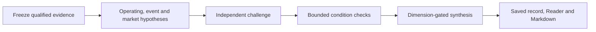

English | [简体中文](README.zh-CN.md)

# TradingAgents

TradingAgents is a local, LangGraph-based multi-agent research framework built on [TauricResearch/TradingAgents](https://github.com/TauricResearch/TradingAgents). This fork focuses on China A-shares: it gathers market, sentiment, news, and company evidence; checks its quality; tests opposing theses; and publishes a reviewable research case. The local Web workbench is the maintained product entry. It supports company research, catalyst research and holding review, with saved evidence, explicit unknowns and deterministic calculations. CLI analysis is retained as legacy code and is no longer maintained.

## Demo

Version 3.0.0 makes the Web workbench the maintained product and retires new
classic/catalyst-profile runs. See the [release notes and migration boundary](docs/reviews/2026-10-05-v3-release-notes.md).

Watch a 20-second walkthrough of a historical A-share research-only sample (the previous interface). English annotations guide the original Chinese interface; the video is for research demonstration only, not investment advice.

[](https://david188888.github.io/videos/tradingagents-demo.mp4)

[Open the 20-second demo video](https://david188888.github.io/videos/tradingagents-demo.mp4) · [View the project page](https://david188888.github.io/en/projects/tradingagents/)

## Research pipeline

The Web workbench uses `evidence_v1` for all new single-company and batch runs:


```mermaid
flowchart LR
    A[Freeze qualified evidence] --> B[Operating, event and market hypotheses]
    B --> C[Independent challenge]
    C --> D[Bounded condition checks]
    D --> E[Dimension-gated synthesis]
    E --> F[Saved record, Reader and Markdown]
```

Company research covers operating quality, valuation and market context;
catalyst research uses an 84-calendar-day outlook; holding review rechecks
user-provided holdings and the original thesis. Batch research uses the same
company workflow. Roles and attempt limits are fixed by code.

The Reader puts judgement, unresolved risks and key evidence first, followed by
valuation context, historical risk statistics and the next check. References
open saved content with timestamps and hashes. Reading does not fetch data or
invoke models. A completed run may remain `partial / LOW_CONFIDENCE`.

Native sources prioritize bounded public company profiles, Sina financial
tables, CNINFO disclosures and qualified Tencent/Sina adjusted prices, with
Tushare backup. V4 adds a dated Tencent valuation snapshot and Tushare daily
PE/PB history. The existing pure valuation chain computes historical positioning
and, when qualified annual consolidated profit attributable to parent
shareholders and enough history exist, a multiple-based reference interval.
Missing inputs remain unavailable. Historical multiples are retrieved at the
current cutoff and do not prove archived point-in-time availability; intervals
are assumption-dependent research aids.

New runs use workflow V5. Selected official reports, summaries and operating
notices retain page/hash references, explicit current/prior numbers and cash-flow
bridge rows. Code checks three bounded evidence questions before synthesis.
Dated institution EPS and same-session industry-candidate quotes supplement
valuation context when available; optional failures preserve other local results.
The Reader distinguishes an answered evidence question, an observed risk and a
future observation. Economic causes, persistence and fair value remain separate
judgements; a passed check does not close them or upgrade research quality.

Old `classic` and `catalyst_v1` records remain readable and compatible interrupted
runs can resume with their original topology and spent budgets. New creation
and fresh retry for those profiles return `410 research_profile_retired`.
Native creation is enabled by default; `TRADINGAGENTS_EVIDENCE_ENABLED=false`
blocks new runs, batches and retries while preserving reading and recovery.
No automatic rewrite or deletion of old records occurs.

See [Web operations](docs/operations/evidence-research.md),
[research record](docs/contracts/research-record.md),
[valuation rules](docs/contracts/valuation-assessment.md) and
[architecture](ARCHITECTURE.md). Real smoke evidence validates operation on a
specific symbol; it does not establish predictive accuracy or a completed
same-evidence quality comparison.

## Quick start

Python 3.10 or newer is required. Configure an API key for your chosen LLM provider and any optional data or news services you use; the default LLM provider is DeepSeek. Keep credentials in the ignored local files.

```bash
git clone https://github.com/david188888/TradingAgents.git
cd TradingAgents
python3 -m venv .venv
source .venv/bin/activate
pip install -e ".[china,web]"

cp .env.example .env
cp tradingagents.config.example.json tradingagents.local.json
# Set your LLM key in .env (for example DEEPSEEK_API_KEY), and configure
# the data providers you use (for example TUSHARE_TOKEN for A-share financials).
# Adjust tradingagents.local.json if you want to change the default routing.

tradingagents web --port 8765 --open  # local workbench
```

The web server binds to `127.0.0.1`; the bundled frontend needs no Node.js at runtime. Configuration comes from `TRADINGAGENTS_*` environment variables, or the ignored local JSON file. Blank results, cache, memory-log, and news-cache path settings use their built-in defaults. See [.env.example](.env.example) and [default_config.py](tradingagents/default_config.py). Local runs and reports live under `~/.tradingagents/`; see [the architecture map](ARCHITECTURE.md) for paths. Developers changing `frontend/src/` should rebuild `tradingagents/web/static/` with `npm --prefix frontend run build`.

For official DeepSeek V4.1 Flash, `deepseek-flash` is supported in both model
tiers; existing `deepseek-v4-flash` configurations remain accepted. Thinking
defaults to enabled with effort `high`. An explicit disabled setting omits the
effort so it cannot re-enable thinking. Optional `deepseek_task_efforts` can
override individual agents, native/legacy stages and auxiliary tasks; unlisted
tasks retain the global setting. Defaults remain `high`; see
[model reasoning configuration](docs/operations/llm-reasoning.md).

## More documentation

- [Documentation index](docs/README.md) and [current architecture](ARCHITECTURE.md)
- [Research Reader architecture](docs/architecture/research-reader.md) and [web batch analysis](docs/operations/web-batch-analysis.md)
- [Agent working rules](AGENTS.md), [contract index](docs/contracts/README.md), and [contributing guide](CONTRIBUTING.md)

The project license is in [LICENSE](LICENSE).

## Differences from upstream and acknowledgments

This fork retains the LangGraph multi-agent foundation of [TauricResearch/TradingAgents](https://github.com/TauricResearch/TradingAgents). Its A-share-oriented research path adds local-market provider routing and supplemental data, an Evidence Steward gate before debate, explicit source and uncertainty handling, typed research cases, and a local Reader/Audit workbench. The current public modes end in a research-only review; they do not run the original trading-decision path. These are this fork's design choices, not claims that upstream lacks every corresponding capability.

Thanks to the TauricResearch contributors for the original TradingAgents framework and to [Simon Lin](https://github.com/simonlin1212/a-stock-data) for the A-share data reference. Thanks also to the maintainers of the data providers and open-source libraries used here.
