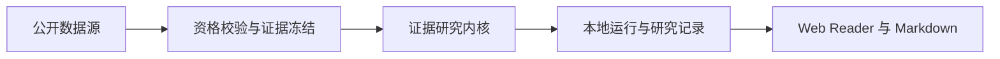

简体中文 | [English](README.en.md)

# TradingAgents

面向中国 A 股的本地多 Agent 研究工作台，源自 [TauricResearch/TradingAgents](https://github.com/TauricResearch/TradingAgents)。它把公司资料、公告、财务和行情组织成可复核的研究记录，帮助研究者看清**关键依据、主要疑点和下一步需要验证什么**。

支持公司研究、催化研究、持仓复盘与批量公司研究。持续维护的入口是 Web 工作台；系统不生成订单或目标仓位，也不构成投资建议。

[](https://david188888.github.io/videos/tradingagents-demo-20261008.mp4)

24 秒演示：英文旁白与字幕，展示当前 Reader 中保存的历史研究样例（2026-10-06）；点击封面播放。

## 项目亮点

- **A 股证据链**：整合公开公司资料、官方披露、财务与行情，保留来源、时点和覆盖限制。
- **有分工的多 Agent 研究**：经营、事件、市场专项独立形成假设，由挑战与综合角色审查；代码负责证据资格、引用校验与确定性计算。
- **可追溯的研究阅读**：从结论回看依据、疑点和各 Agent 的产物；Reader 与 Markdown 使用同一保存记录，阅读不重新取数或调用模型。

## 整体架构与 Agent 设计


```mermaid
flowchart LR
    A[公开数据源] --> B[资格校验与证据冻结]
    B --> C[证据研究内核]
    C --> D[本地运行与研究记录]
    D --> E[Web Reader 与 Markdown]
```

| 角色／层 | 职责 |
| --- | --- |
| 经营、事件、市场专项 Agent | 使用各自的证据视图提出假设与失效条件，互不读取其它专项草稿。 |
| 独立挑战 Agent | 寻找反证、证据缺口与需要核查的条件。 |
| 综合 Agent | 综合证据与挑战，形成分维度判断、关键疑点和下一步。 |
| 代码宿主 | 控制数据准入与运行边界，核查可计算条件，校验并保存研究结果。 |

基础研究先独立完成并保存，再按需回应用户关注点；补充回应不能改写基础结论。完整执行、恢复和模块边界见[系统架构](ARCHITECTURE.md)。

## 快速开始

需要 Python 3.10+ 和所选模型供应商的 API Key。默认模型为 DeepSeek V4.1 Flash（`deepseek-flash`）。

```bash
git clone https://github.com/david188888/TradingAgents.git
cd TradingAgents
python3 -m venv .venv
source .venv/bin/activate
pip install -e ".[china,web]"

cp .env.example .env
# 在 .env 中填写 DEEPSEEK_API_KEY，或配置其它模型供应商。

tradingagents web --port 8765 --open
```

Web 仅绑定 `127.0.0.1`，自带前端，运行时无需 Node.js；运行记录保存在 `~/.tradingagents/`。凭据仅放在被 Git 忽略的本地配置中。数据权限与配置见 [.env.example](.env.example) 和 [Web 操作说明](docs/operations/evidence-research.md)。

## 当前限制

- **覆盖有限**：公开来源可能缺失、限流或无法验证历史时点；部分交易日历与历史估值能力依赖 Tushare 凭据和权限。
- **研究质量仍需验证**：运行完成可能仍是 `partial / LOW_CONFIDENCE`；证据核查通过不代表经济原因或合理价值已确定，也未证明预测准确率提升。
- **产品范围明确**：当前维护本地 A 股 Web 研究；CLI 分析不再维护，旧流程保留历史读取与兼容恢复。

## 深入了解

| 想了解什么 | 文档入口 |
| --- | --- |
| 整体架构、模块职责与 Agent 边界 | [ARCHITECTURE.md](ARCHITECTURE.md) |
| 运行、数据源、模型与恢复 | [Web 操作](docs/operations/evidence-research.md) · [模型配置](docs/operations/llm-reasoning.md) |
| 研究记录与证据契约 | [契约索引](docs/contracts/README.md) · [研究记录](docs/contracts/research-record.md) |
| Reader 的证据追溯与展示 | [Reader 架构](docs/architecture/research-reader.md) |
| 编码 Agent 与贡献者如何修改项目 | [AGENTS.md](AGENTS.md) · [CONTRIBUTING.md](CONTRIBUTING.md) |
| 全部文档与发布记录 | [文档索引](docs/README.md) · [3.1 发布说明](docs/reviews/2026-10-07-v3.1-release-notes.md) |

编码 Agent 从 [AGENTS.md](AGENTS.md) 开始；当前行为以代码、契约和当前状态文档为准，历史计划不是实现证据。


## 致谢与许可

感谢 [TauricResearch](https://github.com/TauricResearch/TradingAgents) 的多 Agent 框架、[Simon Lin](https://github.com/simonlin1212/a-stock-data) 的 A 股数据参考，以及数据服务与开源库维护者。本 fork 在上游基础上发展了上述证据研究与本地工作台设计。许可见 [LICENSE](LICENSE)。
