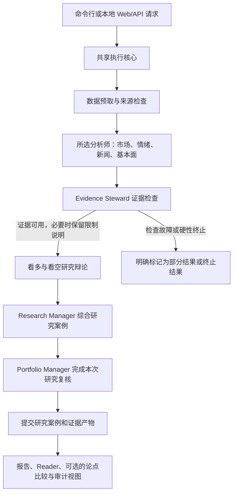

[English](README.md) | 简体中文

# TradingAgents

TradingAgents 是一个基于 LangGraph 的本地多智能体研究框架，源自 [TauricResearch/TradingAgents](https://github.com/TauricResearch/TradingAgents)。本 fork 主要面向中国 A 股：收集市场、情绪、新闻和公司基本面证据，检查证据质量，通过多空观点检验研究假设，并生成可复核的研究案例。命令行和本地 Web 工作台共用同一套执行核心。系统用于公司研究和持仓复盘，不生成订单或目标仓位，也不构成投资建议。

## Demo

观看一个已完成的 A 股研究样例演示，时长 20 秒。视频保留中文原界面并配有英文说明，仅用于展示研究流程，不构成投资建议。

[](https://david188888.github.io/videos/tradingagents-demo.mp4)

[打开 20 秒演示视频](https://david188888.github.io/videos/tradingagents-demo.mp4) · [查看项目页面](https://david188888.github.io/en/projects/tradingagents/)

## 研究流程

命令行和 Web 工作台会将结构化请求交给同一套 LangGraph 流程。当前公开模式为 `company_research` 和 `holding_review`；命令行默认执行公司研究，持仓复盘需要通过 Web/API 提供持仓背景。图执行确定性数据预取，然后按顺序运行所选分析师，并在辩论前检查证据。



Evidence Steward 会区分 `PASS`、`LOW_CONFIDENCE` 和 `FAIL_STOP`；意外的检查故障也会终止流程。运行完成并不代表数据完整，结果仍可能包含未知项或覆盖不足。研究产物从已提交的运行状态发布；Reader 和 Audit 视图展示运行时保存的结果，不会现场重新请求数据。旧版 Trader 和三方风险辩论已从当前执行图中移除。执行与持久化边界请参阅[架构说明](ARCHITECTURE.md)。

## 数据与 Agent 职责

数据供应商路由由 `tradingagents/dataflows/` 管理。下表列出代表性接口，不表示每个供应商都能覆盖任意标的或日期。供应商故障和数据覆盖不足会被明确记录。

| 证据类别 | 代表性接口 | 当前数据来源 |
| --- | --- | --- |
| 行情与指标 | `get_stock_data`、`get_adjusted_price_history`、`get_indicators` | A 股数据会按接口能力和配置路由至 mootdx、Tushare 或 AKShare；技术指标也可在本地计算。 |
| 公司财务与估值 | `get_fundamentals`、`get_balance_sheet`、`get_cashflow`、`get_income_statement`、`get_a_share_valuation` | 财务数据来自 Tushare、Sina；腾讯提供 A 股当前估值快照。 |
| 新闻与披露 | `get_news`、`get_a_share_cninfo_announcements`、`get_a_share_exchange_announcements` | 使用已配置的搜索/新闻服务以及巨潮或交易所披露；部分查询会使用明确标注为公开备份的东方财富来源。 |
| A 股研究补充数据 | `get_a_share_dragon_tiger`、`get_a_share_lockup_releases`、`get_a_share_adjust_factors`、`get_a_share_valuation_history`、`get_china_pmi` | 根据接口分别来自东方财富、新浪、baostock 和国家统计局。 |

部分 A 股数据补充适配器参考了 [Simon Lin 的 a-stock-data](https://github.com/simonlin1212/a-stock-data)，包括复权因子、历史估值、上市信息、筹码分布和宏观数据。这些适配器由本项目自行实现并路由；运行本项目不需要安装完整的 a-stock-data 工具包。数据来源和降级行为见 [A 股数据能力说明](docs/operations/a-share-data-capabilities.md)。

| Agent 或阶段 | 主要职责 |
| --- | --- |
| Market Analyst（市场分析师） | 分析价格走势、技术指标和市场结构。 |
| Sentiment Analyst（情绪分析师） | 评估可用新闻和社交来源中的关注度与情绪。 |
| News Analyst（新闻分析师） | 解读公司新闻、公告和潜在催化因素。 |
| Fundamentals Analyst（基本面分析师） | 检查财务报表、估值和业务质量。 |
| Evidence Steward（证据管家） | 在辩论前检查覆盖度、矛盾和来源，并记录证据限制。 |
| Bull Researcher（看多研究员） | 构建有证据支撑的正向论点。 |
| Bear Researcher（看空研究员） | 用反面证据和失效条件检验看多论点。 |
| Research Manager（研究经理） | 综合辩论和分析师报告，形成研究案例。 |
| Portfolio Manager（组合经理） | 以研究复核结束运行；持仓复盘时附上持仓摘要，不生成交易订单。 |

四位分析师可以由用户选择和排序；其后的收敛流程固定。Web 工作台通过 FastAPI/SSE 推送运行进度，并由内置的 React/TypeScript 前端展示已保存的报告、Reader 和审计记录。

## 快速开始

需要 Python 3.10 或更新版本。为所选 LLM 供应商配置 API Key，并按需配置数据或新闻服务；默认 LLM 供应商为 DeepSeek。请将凭据保存在被 Git 忽略的本地文件中。

```bash
git clone https://github.com/david188888/TradingAgents.git
cd TradingAgents
python3 -m venv .venv
source .venv/bin/activate
pip install -e ".[china,web]"

cp .env.example .env
cp tradingagents.config.example.json tradingagents.local.json
# 在 .env 中设置 LLM Key（例如 DEEPSEEK_API_KEY），并配置所用数据供应商
# （例如 A 股财务数据可设置 TUSHARE_TOKEN）。
# 如需修改默认路由，可编辑 tradingagents.local.json。

# 选择一个入口：
tradingagents analyze                 # 交互式公司研究
tradingagents web --port 8765 --open  # 本地 Web 工作台
```

Web 服务仅绑定到 `127.0.0.1`；运行时无需安装 Node.js。配置可来自 `TRADINGAGENTS_*` 环境变量、本地 JSON 文件或交互式提示。结果、缓存、记忆日志和新闻缓存路径留空时会使用内置默认值。完整选项见 [.env.example](.env.example) 和 [default_config.py](tradingagents/default_config.py)。本地运行记录和报告保存在 `~/.tradingagents/`；路径说明见[架构文档](ARCHITECTURE.md)。修改 `frontend/src/` 后，开发者应运行 `npm --prefix frontend run build`，并更新 `tradingagents/web/static/` 中的生成文件。

## 更多文档

- [文档索引](docs/README.md)与[当前架构](ARCHITECTURE.md)
- [Research Reader 架构](docs/architecture/research-reader.md)与 [Web 批量分析](docs/operations/web-batch-analysis.md)
- [Agent 工作规则](AGENTS.md)、[契约索引](docs/contracts/README.md)和[贡献指南](CONTRIBUTING.md)

项目许可条款见 [LICENSE](LICENSE)。

## 与上游的区别及致谢

本 fork 保留了 [TauricResearch/TradingAgents](https://github.com/TauricResearch/TradingAgents) 的 LangGraph 多智能体基础，并围绕 A 股研究增加了本地市场数据路由和补充数据、辩论前的 Evidence Steward 证据检查、来源与不确定性的显式记录、结构化研究案例，以及本地 Reader/Audit 工作台。当前公开研究模式以研究复核结束，不再执行原有的交易决策流程。这些是本 fork 的设计选择，不代表上游没有任何类似能力。

感谢 TauricResearch 的贡献者开发 TradingAgents 框架，感谢 [Simon Lin](https://github.com/simonlin1212/a-stock-data) 提供 A 股数据参考，也感谢本项目所用数据服务和开源库的维护者。
