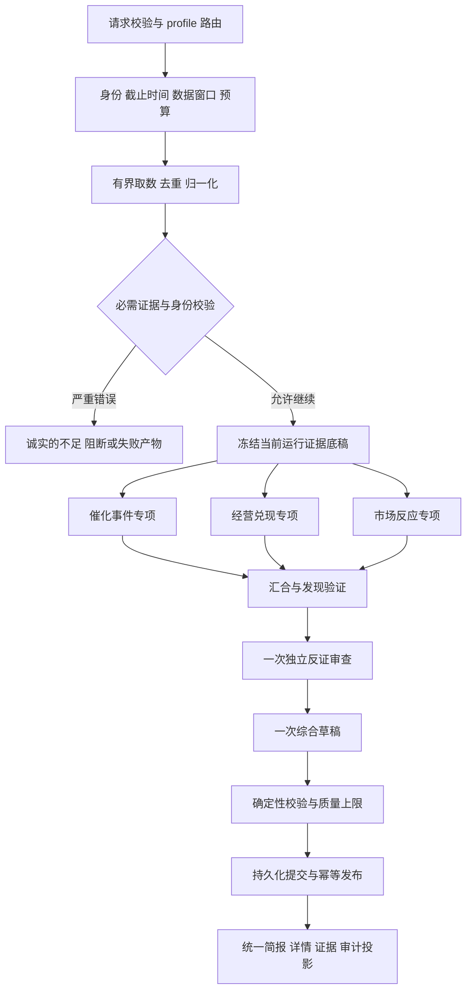

# TradingAgents 中短期催化研究重构：设计、实施计划与验收

Status: Frozen Design

Do not use this document as evidence of current implementation behavior.

归档日期：2026-10-04。正文保留编写时的设计、结果和未完成事项；归档不表示全部目标已验收。当前行为与仍待推进的计划见[文档索引](../../README.md)。

> 编写时状态：Proposed — 工程交付设计，尚未实施。不得作为当前运行行为的说明。Do not use this document as evidence of current implementation behavior.
- 创建日期：2026-09-28；交付修订：2026-09-29。保留原文件名便于链接稳定。
- 代码核查基线：`bc70a35580988de234b90520fbdf4b71373f012b`。工程开始时重新确认分支、差异和依赖，不假定本文基线仍是 HEAD。
- 交付对象：产品、前端、后端、数据工程与验收负责人。
- 产品方向、页面 A 和下述有界研究流程已由用户确认；字段命名、预算与分阶段门槛属于本文提出的工程方案，须通过代码评审与实测，不能被描述为已实现效果。
- 本轮范围：设计文档与交互草图；没有修改产品代码、调用真实研究模型或验证数据端点。
- 当前系统入口：[文档索引](../../README.md)、[架构](../../../ARCHITECTURE.md)、[契约索引](../../contracts/README.md)。
- 已选布局：[交互草图](../../superpowers/specs/2026-09-28-catalyst-research-layout.html)，选择 A。草图中的公司、事件与数据全部虚构；HTML 是设计参考，不是生产组件。

### 阅读导航

- 产品与设计：第 1–4 节；研究流程与质量规则：第 5–6 节。
- 后端与数据：第 7–11 节；实施任务：第 12 节（T01–T39）。
- 验收与发布：第 13–16 节；本次真实交付状态：第 17 节。
- 单独转交本 Markdown 即可执行核心方案；HTML 为可选附件。仓库相对链接用于工程定位，脱离仓库时按文中路径查找。

## 0. 给执行工程师的快速说明

本次不是一次纯 CSS 调整。需要同时改变**读者先看到什么、agent 产出什么、证据如何进入结论**。实施顺序为：建立基线 → 定义新契约 → 数据与证据底稿 → 新流程 → 新页面 → 对照验收 → 切换默认入口。

最终体验：用户输入单家公司，研究未来几周到一个季度的催化，完成后先看到一份约 200–300 字的研究简报，知道是否值得继续研究、关键依据、最大疑点与下一步验证内容。详情与原始公开报告仍可查看，但不会在首页重复铺开。

默认新流程为三个专项分析（催化事件、经营兑现、市场反应），再经过一次独立反证审查和一次综合。共享当前运行的证据底稿，不让每个角色重复检索、重复写公司全景报告。证据门控、身份核验、时点约束、持久化提交和恢复机制必须保留。

旧公司研究、长期研究、持仓复盘、批量入口及审计能力保留。新增流程采用显式 profile，禁止靠改旧 mode、旧 horizon 或角色名字悄悄改变历史契约。

**发布判定：可读性与证据质量必须同时通过；篇幅变短、模型调用变少、页面变漂亮，任何单项都不等于重构成功。**

## 1. 已确认的用户决策与范围

| ID | 已确认决策 | 工程含义 |
| --- | --- | --- |
| D1 | 第一分钟判断公司是否值得继续研究、关键依据和最大疑点 | 首页围绕研究优先级，不围绕 agent 清单 |
| D2 | 主要关注未来几周至一个季度的催化 | 事件、兑现路径和市场反应优先；财务用于验证和风险约束 |
| D3 | 综合原建议 B 与 C | 同时改输出/UI 和研究流程，而非只折叠旧长文 |
| D4 | 默认单家公司主线；其余功能放次级入口 | 保留持仓、长期、原始报告、审计及已有批量能力 |
| D5 | 页面选择 A：单栏研究简报 | 证据按需展开，不默认常驻右侧，不默认展开辩论时间线 |
| D6 | 三专项＋一次独立反证＋一次综合，职责与调用有上限 | 新 profile 替代固定多空轮流辩论；旧模式保留原流程 |
| D7 | 交付全面的 Markdown 给工程师执行 | 本文件包含任务、依赖、接口方向、异常处理和验收，不在本轮实现产品 |

### 1.1 本轮必须完成的产品能力

- 单家公司中短期研究的发起、运行、完成、部分结果、失败与恢复体验。
- 唯一的首屏简报与统一事实来源；详细研究、证据、研究过程分层。
- 有界研究流程、结构化角色输出、独立反证、简报与证据绑定。
- 腾讯行情可靠性评估与按能力接入；业绩事件、回购进度与调研记录的有界补充。
- 旧运行可读、旧 profile 可用、未通过验收可回滚。

### 1.2 不在本次范围

- 自动下单、买卖数量、仓位配置、收益预测承诺。
- 全市场自动选股、定时推送、自主长时运行或无限补资料。
- 通用聊天 agent 平台、递归委派、任意工具市场。
- 为追求信息量接入全部 a-stock-data 端点、逐笔交易系统、期权/期货/可转债研究。
- 重写所有旧研究模式；删除用户历史、缓存、配置或报告。
- 更换 React/FastAPI/LangGraph 技术栈或默认模型供应商。本次使用 GPT‑6 Luna 做调研，不等于指定运行时模型。

## 2. 第一性原理：目标、约束与失败条件

### 2.1 目标

研究工具的价值是降低“找到关键问题和检查依据”的成本。一次有用的研究必须回答：

1. **为什么现在关注？** 具体催化或变化是什么，时间窗口在哪里？
2. **变化如何传导？** 如何影响经营、预期或风险；哪些环节只是推断？
3. **最大反证是什么？** 什么事实会推翻当前假设？
4. **目前知道多少？** 来源是否足够，哪些关键字段缺失？
5. **下一步查什么？** 明确的资料、事件或指标，而非“持续关注”。

### 2.2 不变量

- 结论必须来自本次运行已提交的产物。打开页面、切换标签、展开证据不再次调用模型或刷新第三方数据。
- 事实、推断、未知分开；转载不算独立证据；行业改善不能证明个股订单。
- 数据不可用不是没有事件；没有找到反证不是已经验证。
- 财报期、公告发布时间、事件发生时间、采集时间和研究截止时间分开。
- 缺失、冲突与校验失败不得被摘要润色成高置信度结论。
- 历史运行不会因新的模型、规则、页面或数据而被重写。
- UI 保持研究用途；研究优先级不能冒充买卖建议、上涨概率或收益排名。
- 配置按运行隔离；共享数据只在明确相同的身份、时点、口径与来源范围内复用。

### 2.3 明确的失败条件

以下任一项出现，都不能通过发布验收：关键风险被短摘要删掉；无来源的确定事件日期；缺数据被标为无风险；用当前行情证明历史时点结论；同一事件转载被视为多源确认；重连导致重复模型调用/产物；旧持仓复盘或历史读取失效；超预算后继续调用；新页面再次同时展示两套摘要。

## 3. 当前实现核查与诊断

以下为基线源码核查事实，不代表真实供应商或完整运行已通过验证。

| 现状 | 代码依据 | 设计影响 |
| --- | --- | --- |
| 完成页连续挂载 DecisionBrief、ReaderSurface、DebateTimeline | `frontend/src/components/layout/WorkbenchLayout.tsx` | 页面必须重组，不能只改 ReaderSurface |
| learning_summary 的事实/推断/情景等展示后，还会再展示驱动、风险、验证节点 | `frontend/src/components/reader/DecisionBrief.tsx` | 首屏要有唯一主摘要；去重不能依赖 CSS 隐藏 |
| Reader 展开事实、推断、未知、情景、分析视角，前面还有指标研究包 | `frontend/src/components/reader/ReaderSurface.tsx` | 改为研究问题优先，技术/学习性详情后置 |
| 基本面提示词包含 as much detail as possible | `tradingagents/agents/analysts/fundamentals_analyst.py` | 新 profile 从产出契约限制冗余 |
| 分析师当前按序执行；默认多空轮数为 1 | `graph/setup.py`、`default_config.py`、`graph/conditional_logic.py` | 不能声称现状是无限辩论；新流程收益须实测 |
| 多空开场可携带完整报告，后续回合已有长度约束；综合再消费报告与历史 | `agents/researchers/`、`agents/managers/research_manager.py` | 已有局部压缩，但尚未统一为原子证据/发现交接 |
| Portfolio Manager 为确定性收尾，不调用传入的 llm | `agents/managers/portfolio_manager.py` | 删除该节点不能算模型成本优化 |
| Evidence Steward 会走覆盖分析、语义聚类和补充路径，内部可能调用模型 | `agents/evidence_steward.py`、`dataflows/evidence_gate.py`、`consistency.py` | 必须统计隐含调用；复用其语义而非照搬所有旧路径 |
| 原始 K 线和复权行情是独立能力 | `dataflows/registry.py`、`research/price_prefetch.py` | 两条路由分别验证，不把 raw fallback 用作复权证据 |
| 现有 ResearchCaseV2、ResearchPackage、Reader、RunView 与审计是不同产物/投影 | `agents/schemas/`、`research/`、`web/projections.py` | 必须建立共同来源，不能新加第三套相互独立的摘要 |
| 运行与 checkpoint 有提交、指纹和回放约束 | `execution/runner.py`、`runtime/fingerprint.py`、`observability/canonical.py` | 角色和拓扑变更必须同时处理恢复与发布 |

**根因判断：** 当前系统主要按“生产过程与产物类型”组织信息；用户需要按“研究问题的重要性”阅读。冗余同时存在于上游角色产出和下游页面呈现，必须一起处理。

## 4. 目标用户旅程与页面信息架构

### 4.1 新建研究

默认表单只展示：公司名称/代码、研究窗口“未来几周至一季度”、可选关注问题、开始研究按钮。

- 公司名称必须解析为可核验的证券身份；同名/多市场结果要求选择，不能猜。
- 默认研究日期为当前可支持的日期，并展示实际采用的数据截止时间。盘中取数无法保证完整交易日时，明确使用上一完整交易日或标注盘中快照，不伪装成已收盘数据。
- 可选问题示例：“近期订单变化能否在下次业绩披露中兑现？”输入可留空，由固定框架研究催化，不先加一个开放式规划 agent。
- 持仓复盘、长期/旧公司研究、批量入口放在“更多研究”；数据源、模型、超时和旧角色选择放高级设置。
- 新默认 profile 不让用户逐个勾选新角色，避免勾选组合破坏证据要求；旧 profile 保留原角色选择。
- 不自动提交现有高级表单中的隐藏配置；profile 切换时显示有效配置摘要。

### 4.2 运行中

主区显示公司、研究问题与四阶段进度：准备证据 → 专项分析 → 反证核验 → 综合发布。

- 展示已完成阶段、当前阶段、耗时和重要数据限制，不持续刷出 agent 长文。
- 有准确工作量才显示百分比；否则使用阶段状态，不能伪造 90% 卡住的进度。
- 展开“查看研究过程”可看角色状态、来源状态、工具调用摘要。
- 保留取消、排队、失败、重试、可恢复中断的既有语义。用户停留在过程页时，完成后提示“简报已就绪”，不强制跳走；默认运行页可在完成时进入简报。
- 未提交的流式候选只显示为处理中，不显示为最终结论。

### 4.3 完成页：布局 A

```text
最近研究（可收起） | 公司 · 研究问题 · 截止时间 · 质量状态
                  | [研究简报] [依据与事件] [研究过程]
                  |
                  | 一句研究判断 + 优先级
                  | 最关键催化与时间窗口
                  | 1–3 条关键依据                     [来源]
                  | 最大疑点 / 最强反证                 [来源]
                  | 下一步验证内容与触发条件
                  | 影响判断的资料限制
                  |
                  | > 展开完整研究（默认收起）
```

首页正文目标 200–300 个可见字符，硬上限 420；统计包含判断、依据、疑点、下一验证和关键限制，不包含导航、字段标签、公司名与时间元数据。数字与英文按 Unicode 字符计数，前后端共享测试样例。少资料时允许少于 200 字，不补废话。

超长必须在产物生成/验证环节处理；前端不能截断事实、隐藏否定词或用省略号掩盖风险。详情文案不受首屏总字数限制，但各条仍有契约上限。

**安全信息溢出规则：** 若预算内修复后，全部重大反证/关键缺口无法在 420 字内忠实表达，不发布普通简报，改用 ≤120 字的代码模板：“本次信息限制较多，暂不能形成可靠的简短判断”，优先级为信息不足，case 为 partial，原因 `brief_safety_overflow`。紧接模板展示默认展开的“影响判断的限制”完整列表，允许滚动；该列表明确豁免普通简报 420 字预算，但不能移到折叠详情、只展示计数或截断。保留底层已验证发现，纯版面溢出不改变事实本身、不冒充身份/证据硬阻断。此规则优先于字数目标，不允许为过长度检查删风险或无限修复。

| 首屏字段 | 显示规则 | 禁止行为 |
| --- | --- | --- |
| 研究判断 | 一句具体判断；不足时直接说信息不足 | 把偏多评级改名为高优先级 |
| 研究优先级 | 优先核查 / 持续观察 / 暂缓研究 / 信息不足 | 默认展示未经校准的百分比评分 |
| 关键催化 | 最多 1 个主催化，可附明确或待确认的时间范围 | 为满足模板编造日期 |
| 依据 | 最多 3 条，每条点开可追溯 | 同一事实换词重复 |
| 最大疑点 | 至少 1 条，或明确“反证覆盖不足” | 用无反证代替安全结论 |
| 下一验证 | 要看什么、何时/何事件触发、为何影响判断 | 只写持续关注 |
| 关键限制 | 会改变优先级/可信度的限制必须常显 | 把来源失效全藏在审计页 |

### 4.4 详情层

- **依据与事件：** 催化时间线、证据列表、已验证/未验证状态、事实与推断、事件状态变化、来源差异、财务与价格背景。按问题分组，不按 agent 排一屏长报告。
- **完整研究：** 经营传导、市场反应、情景与失效条件。引用首屏结论 ID，避免重复整段文字。
- **研究过程：** 角色产出、反证处理、调用与耗时、降级原因、旧报告入口、审计中心。不能展示秘密、原始提示词或私有推理。
- **证据详情：** 桌面按需抽屉；窄屏弹层/独立详情区域。展示公开来源标题、发布时间、事实摘录、支持/限制哪些结论。没有合法公开链接时显示来源标识及限制，不暴露内部 locator。
- 证据抽屉打开/关闭必须管理焦点、Esc、背景 inert 和返回位置；复用并验证现有 Companion/Audit 的可访问性逻辑。
- 行情图若展示，放在“依据与事件”，默认日线、明确复权口径与截止时间；不能用实时刷新改变既有结论。

### 4.5 状态矩阵

| 情况 | 主区行为 | 可执行操作 |
| --- | --- | --- |
| 排队/运行中 | 阶段进度，不显示最终优先级 | 取消、查看过程 |
| 完成且证据充分 | 完整简报，证据按需查看 | 详情、新研究 |
| 完成但受限 | 简报＋关键缺口；按规则限制研究优先级 | 查看缺口、以新 run 补做 |
| 必需证据不足 | “信息不足”，仍列出可验证事实与缺口 | 查看来源状态、重试新 run |
| 门控阻断/错误 | 不形成方向性结论；区分研究阻断与系统故障 | 审计、按现有语义重试 |
| 取消/中断 | 明确非完整结果；已提交资料只作过程查看 | 兼容检查后恢复，或创建新 run |
| 旧记录无新产物 | 旧摘要/报告入口＋版本标签 | 阅读旧记录，不后台重算 |
| 投影损坏 | 可由提交事实确定性重建；失败则显示稳定错误 | 重试读取、审计 |

### 4.6 视觉与交互验收边界

- 延续草图 A 的单栏层级、克制配色和留白；字体、间距用现有设计变量统一实现，不复制 HTML 成生产页。
- 1440×900、1280×800 下，核心五项应在不打开详情的情况下读完；首屏正文可因系统字体少量滚动，但不能先越过图表/指标表/agent 图才能看到结论。
- 390×844 与 200% 缩放时保持单列、无页面横向滚动；允许纵向滚动，不以缩小文字硬塞“一屏”。
- 桌面正文建议 16px、行高约 1.6；最大阅读宽度约 800–920px，左侧历史可收起。
- 颜色不单独承载质量状态；加载、空态、失败态、部分结果态均有明确文字。
- 刷新、切换运行、浏览器后退能保持正确 run 和标签；不同 run 的证据不能串到同一抽屉。

## 5. 目标研究架构

### 5.1 显式工作流与证据冻结



取数之前由代码按 profile 生成能力计划。允许在冻结之前进行**至多一轮**针对缺口的补充，最多涉及 3 个缺失能力；必须消耗同一个运行预算。冻结后专项、反证与综合不再自由联网，缺口进入结果。下一轮补资料通过新 run 完成，不修改旧 run。

### 5.2 角色职责

| 单元 | 唯一问题 | 输入 | 输出 | 不应做的事 |
| --- | --- | --- | --- | --- |
| 催化事件专项 | 为什么现在研究，什么事件可能在窗口内改变判断？ | 事件、公告、新闻与已知时间 | 最多 3 个事件候选、确认程度、时间范围、传导假设与缺口 | 全量新闻摘要；传闻写成正式事件 |
| 经营兑现专项 | 催化如何到收入、利润、现金流或约束条件？ | 财务、公告、同口径预期及事件底稿 | 最多 3 条兑现路径/反向约束、需验证的指标 | 常规公司全景长报告；无依据的盈利预测 |
| 市场反应专项 | 已观察到什么价格/成交/关注变化，还有什么不能判断？ | 同时点行情、成交、可用情绪数据 | 最多 3 条观察及局限、事件前后窗口 | 仅凭涨幅断言市场已充分定价；重复新闻解读 |
| 证据与覆盖校验 | 资料身份、时间、引用、覆盖是否允许这些陈述？ | 证据注册表与结构化发现 | 校验结果、限制、剔除理由 | 以文风/模型赞同升级门控 |
| 独立反证审查 | 哪个关键假设最可能不成立，缺了什么？ | 同一底稿＋三个专项已验证发现 | 最多 3 个 challenge、严重性、受影响 ID、可验证动作 | 为了唱反调捏造事实；再写一遍负面长报告 |
| 综合 | 对下一步研究分配什么优先级？ | 验证后发现、反证、覆盖状态 | 一份结构化简报与完整研究引用关系 | 再调用一个摘要模型；忽略严重反证 |
| 发布 | 什么结果已经可靠提交？ | 验证后的候选、graph task commit | 可回放的公共产物与投影 | 在 commit 前宣布完成 |

三个专项对同一冻结底稿独立运行，不读取其他专项的草稿。反证角色读取发现列表，而不是先被一个高优先级结论锚定。综合必须逐项处理 challenge：接受、部分接受、以已有证据反驳、无法解决；无法解决的关键反证限制最终优先级。

**“独立”指任务上下文与职责隔离，不意味着模型之间统计独立。** 相同模型重复同一材料不能增加来源可信度；模型差异仅可作为后续实验，不是本次默认更换供应商的理由。

### 5.3 情绪与旧角色的处理

新 profile 不另设默认情绪 agent。情绪/资金面是市场反应专项可选输入，新闻由催化专项负责。缺情绪数据不自动阻断正式事件研究，也不能把情绪高涨当作业绩证据。

旧角色 key 和旧 lens 枚举继续服务旧 profile。新增角色与产物使用独立名称，不能把催化角色伪装成旧 `news` 卡片以绕过 schema。涉及代码所有的 skill 角色映射，应修改 `tradingagents/skills/registry.py` 与产物 schema 并评审；Markdown/preset 无权改变拓扑。

### 5.4 并行策略与共享状态

- 三个专项逻辑上独立；初始发布允许并发上限 2。代码提供上限 1 的串行降级，不能把“是否并行”影响到结论语义。
- 新 graph state 使用按角色 key 分区的不可变输出；不要并发写现有共享 `messages`、`sender` 或拼接报告字符串。
- 每个专项拥有自己的临时消息上下文；汇合节点按固定角色顺序读取，结果不能取决于完成先后。
- 对同一任务重复提交同一内容应幂等；同一 ID 不同内容必须报冲突，不能静默覆盖。
- `ContextVar` 的运行配置和 provenance 在执行器/线程边界显式传递；测试并发两个不同供应商配置的 run。
- 必须使用全局 LLM/数据源信号量；不能让 batch 并发数乘以角色并发数无限放大。等待预算与队列耗时单独记录。
- 按角色记录成功、失败、取消和耗时。某专项失败时不等同于零发现；汇合节点按必需证据/角色完整性输出 partial。

### 5.5 建议预算与硬上限

以下是**新 profile 的初始工程默认值**，不是当前配置或已测性能。实施团队可以在 P0 基线后提交有记录的调整，但不得关闭上限。

| 资源 | 初始建议 | 计数方式 |
| --- | --- | --- |
| 主分析模型调用 | 正常路径 5 次 | 3 专项＋1 反证＋1 综合 |
| 语义预处理 | 最多 2 次 | 现有新闻覆盖/聚类若复用也计入；不计作免费工具 |
| 结构化输出修复 | 全 run 最多 2 次；每阶段最多 1 次 | 与 JSON/free-text fallback 合并计数，禁止嵌套重试各算各的 |
| 网络失败导致的模型重试 | 全 run 最多 3 次额外尝试 | 失败调用也记录；auth 错误不重试绕过权限 |
| 模型总尝试 | 最多 12 次 | 主流程、预处理、修复、重试全部包含；先耗尽任一细分额度就按该限制执行 |
| 专项并行 | 最多 2 | 还受全局供应商并发约束 |
| 冻结前补充 | 最多 1 轮、3 个缺失能力 | 不允许冻结后开放式补检索 |
| 数据取数 | 最多 24 个逻辑 capability 调用、64 个 HTTP 尝试 | 分页、失败重试计入 HTTP；复用已有更严格能力预算 |
| 主催化候选 | 最多 3 个 | 首屏最多 1 个；其余详情查看 |
| 专项发现 | 每角色最多 3 条核心发现、3 条未知 | 严重质量错误不受展示条数限制，汇总进门控 |
| 活跃执行时间 | 默认 300 秒 | 从调度开始，不含排队；允许高级设置显式调整并持久化 |

预算检查发生在每次调用之前并预留额度；并发原子扣减。SDK 自带 retry 必须纳入或关闭，不能绕开总预算。限制命中时写出明确 reason，不用额外模型生成“超时解释”。token usage 缺失必须记为未知，不当作 0；绝对费用只在已知价格版本时估算。

预算账本按 `run_id + logical_call_id + attempt_id` 持久化，预留、开始、结束和结果可见性分开记录。恢复同一 run 必须继承所有已消耗/已发出但状态不明的额度，不能从 0 重置；状态不明的网络调用保守计为已消耗，重试使用新 attempt 并受剩余额度限制。仅新 run 可获得新预算，且保留重试来源 run 的关联。

取消或超时后停止调度新请求，向可取消的客户端传播取消；无法终止的在途网络请求可以结束，但其迟到结果不得发布为最终研究结论。不得承诺第三方调用严格 exactly-once；可保证的是本地提交/发布幂等、重复调用可观察且不超预算。恢复时不重发已有已提交结果的逻辑任务。

## 6. 研究优先级：规则与证据上限

不建立一个看似精确、无法校准的 0–100 分总分。使用四个解释性类别，类别评估与涨跌倾向分离。

| 类别 | 语义 | 必需条件/限制 |
| --- | --- | --- |
| 优先核查 | 存在明确、可验证、时间相关且可能改变研究判断的问题 | 主催化/问题有来源，存在明确下一验证；无未处理的硬阻断；可针对负面事件给出此优先级 |
| 持续观察 | 有线索，但触发条件、时间或兑现证据仍不完整 | 显示尚缺的决定性输入 |
| 暂缓研究 | 当前覆盖范围内未发现足够明确的近期待验证问题，或研究假设被已有证据削弱 | 必须先有足够覆盖，不能把取数失败当作暂缓 |
| 信息不足 | 身份、核心证据、时点、关键专项或独立反证无法支撑判断 | 没有“绿色通过”替代语；解释需要补的内容 |

综合模型提出候选类别；代码执行证据与流程完整性上限。硬错误、关键身份冲突、必要来源/观察窗口不合格、反证阶段缺失、关键 unresolved challenge → 不得发布“优先核查”；必要研究条件无法满足时必须降为信息不足。

普通非关键数据缺口可与“优先核查”共存，但首屏必须说明它不支持什么判断；“优先核查”表达值得花时间验证，不表示公司基本面好或应买入。

质量校验分两层：引用、身份和时间等可由代码验证；证据是否真的支持因果推断仍需评审，不能因 schema 通过就标为语义已证实。

## 7. 新产物与契约方向

### 7.1 请求路由

建议新增 `research_profile`：`classic` 或 `catalyst_v1`，作为共享请求的显式字段并进入有效配置/指纹。

- 旧 API/CLI 调用省略该字段时继续 `classic`，保持默认兼容。
- 新 Web 主入口显式发送 `catalyst_v1`；CLI 可以新增显式选项，原命令不静默改语义。
- 首版 `catalyst_v1` 仅支持 `company_research`、A 股普通股票。持仓/非 A 股/crypto 组合由后端明确拒绝，并提示选择 classic；不暗中切换模式。
- 首版固定研究展望窗口上限 84 个日历日（约一季度），作为 profile 参数保存；这是产品时间范围，不等于历史数据取数窗口。草图“2–12 周”是方向说明，不排除未来两周内的已知事件。
- 为保留旧 `horizon` 兼容，新入口发送 `horizon=medium`，但新 profile 必须使用单独版本的 `catalyst-evidence-policy-v1`；不能把旧 medium 的必需角色直接套在新流程上。
- 新 profile 对旧 `selected_analysts` / `research_depth` / `max_debate_rounds` 不赋予调度权。兼容字段若保留默认值，后端规范化并在有效配置中明确“不适用”；非默认显式旧调度参数组合返回可读校验错误，避免让用户误以为生效。
- 表单与 API 的参数校验必须一致；错误时不入队、不扣模型预算。

### 7.2 产物关系

保留 `research-case-v2`、`research-package-v1` 等旧契约的真实含义。建议新建 `catalyst-research-case-v1` 作为新 profile 的权威公共结果，内部有简报和完整发现引用关系；不改变 ResearchCaseV2 的 lens/场景要求来硬塞新流程。

```text
当前运行证据注册表 + 覆盖结果
          ↓
三个 SpecialistFinding 集合 → Challenge 集合 → SynthesisDraft
          ↓ 代码验证 / 证据与质量上限
catalyst-research-case-v1（一次提交）
          ├─ 简报投影
          ├─ 依据与事件投影
          ├─ 研究过程 / 反证处理投影
          └─ Markdown 报告（同源渲染，不再次生成）
```

首版不为新产物伪造旧 ResearchCaseV2。旧 Reader API 对这种 run 返回已有 `kind=unavailable` 形状和既有 `research_case_unavailable` 原因码，保持旧严格枚举客户端能解析；“这是新 profile、请使用新入口”的细分原因只放在新 `/catalyst`、`/view-v2` 契约中。旧 `/view` 保持原 envelope 的无支持摘要降级语义，不注入新评级或新字段。新页面使用专用催化投影。旧 external package 消费者保留旧 run 可读；新 profile 暂不宣称支持 ResearchPackage/ThesisDiff，缺失必须显式。跨 profile 比较不自动进行。

若以后提供新 profile 的指标包或同 profile 差异比较，必须独立完成映射与验收；这不阻塞本次核心简报上线。

### 7.3 必须由代码表达的语义

下表是设计要求，不是用 Markdown 代替 Python schema。实现时创建 canonical Pydantic/dataclass 模型、验证器及序列化测试，再镜像 TS wire contract。

| 对象 | 必需语义 |
| --- | --- |
| Evidence | 本 run 来源引用、证券身份、原始发布与采集时刻、可用截止时间、来源层级、适用能力、时间/数值口径、可用状态、来源家族/转载关系 |
| Event | 事件 ID/版本、类型、目标公司、发布时刻、发生日期或区间、日期精度/确认程度、计划/进展/完成/取消状态、来源引用、被哪次公告更新 |
| SpecialistFinding | 稳定 ID、角色、事实/推断/未知、短文本、支撑事实/证据 ID、限制与下一验证；不存在的引用不能出现在公共产物 |
| Challenge | 稳定 ID、被挑战发现/事件、严重性、反证或缺证的区分、证据 ID、检验方式 |
| ChallengeDisposition | 每条 challenge 的处理结果、依据引用与保留限制；关键未解决项不得丢失 |
| CatalystResearchCase | run/ticker/cutoff/profile/policy/schema、质量状态、发现/事件/反证集合、最终研究优先级、简报引用、完成程度与原因 |
| Brief | 一句判断、最多 1 个主催化、最多 3 条依据、最大疑点、下一验证、关键限制；每项引用权威对象，而非独立编造长文本 |
| BudgetUsage | 各类调用尝试、修复、重试、HTTP 分页与预算消耗、模型 usage 可用性、阶段耗时、终止原因 |

额外验证要求：ID 在 run 内唯一；所有依赖可解析；推断必须依赖存活的事实；未知不带虚假证据或置信度；数值有单位和期间；无依据日期保持未知；引用剔除后递归检查依赖；简报不得引用被剔除发现。

不可只靠截取报告前 N 个字符得到公共短文本。生成时有篇幅约束、验证时有字符上限，失败走预算内修复；仍失败则生成代码模板的受限结果，不用另一个无限制摘要模型。

### 7.4 API、发布与投影

新增只读 `GET /api/runs/{run_id}/catalyst`，返回判别式 `ready | unavailable | unsupported` 与版本字段。`ready` 表示产物可读取，公共 case 仍可为 complete/partial/blocked；HTTP 可读成功不等于研究充分。

固定边界：run 不存在沿用 404；run 存在但未发布产物为 HTTP 200 `unavailable`，附 running/not_committed/missing/corrupt 等新契约原因；classic run 或未知 profile 为 HTTP 200 `unsupported`；已提交且可校验的阻断报告为 HTTP 200 `ready`、case completeness 为 blocked、优先级为信息不足。内部异常走现有安全错误 envelope，不泄露异常原文。前端同时依据 run 生命周期和 case completeness 渲染，不能因为 `ready` 显示“研究完整通过”。

- endpoint 从已提交的 catalyst 产物读取，禁止访问 provider 或 LLM。
- 公共详情不暴露内部 hash、locator、secret、原始 payload；安全公开 URL 单独验证协议与敏感 query。
- `RunView` 的新 envelope 使用显式新 schema 版本表达 profile 与摘要来源，不悄悄扩大旧 `ReaderBrief` 的字段语义。保留旧 view v1 endpoint/投影供旧消费者；固定新增 `/api/runs/{id}/view-v2` 给新页面，避免实施时再分歧为隐式协商。v2 可描述 classic 与新 profile，摘要读取分别路由，不从旧文字推导新研究优先级。
- 新完成页只有一个摘要容器；classic 的旧 Brief 与 Reader 也应整理成“概要/详情/过程”，不得继续默认双摘要堆叠，但不改变旧事实与评级。
- SSE 继续使用当前 run 生命周期事件；新增角色需要更新 role registry、事件验证、公共阶段投影与 TS 消费端。不能将新角色强制标为 Bull/Bear。
- 产物写入挂在现有 graph commit barrier 之后；只有引用可读、产物写入成功，才允许发布对应最终完成视图。
- 投影版本变化可失效重建缓存；不能改变原始事件与产物。刷新和 SSE 重连都不得触发重算。

## 8. 数据源策略与 a-stock-data 对照

### 8.1 调研基准与局限

2026-09-28 核查上游 main 为 `f814dcfe209dd7958f4858f9d878d591ee85fb56`，提交时间 2026-09-25 09:56:12 UTC；最新能力版本说明为 v3.10.0（2026-09-22）。该 main 提交本身主要为 README 文案变化。调研使用了 GPT‑6 Luna 子代理与源码/公开文档核对。

- [固定版本 README](https://github.com/simonlin1212/a-stock-data/blob/f814dcfe209dd7958f4858f9d878d591ee85fb56/README.md)
- [固定版本 CHANGELOG](https://github.com/simonlin1212/a-stock-data/blob/f814dcfe209dd7958f4858f9d878d591ee85fb56/CHANGELOG.md)
- [上游主仓库](https://github.com/simonlin1212/a-stock-data)

上述资料是候选能力与变更线索，不是生产可用性证明。此次没有运行端点探测。上游是结构化技能说明与内嵌代码，不能视为稳定的统一服务 API；按能力借鉴和适配，不直接运行远端 SKILL.md，也不整包替换本地 provider。

### 8.2 分优先级接入

| 优先级 | 能力 | 当前覆盖/缺口 | 实施要求 |
| --- | --- | --- | --- |
| P0 | 行情来源可靠性 | 上游报告 mootdx 公开行情命令失效；本地普通 K 线仍优先 mootdx、Tushare 可兜底 | 实测主源与 fallback；确认异常/空数据语义；不直接删除全部 mootdx 财务/F10 能力 |
| P0 | 腾讯日线/复权日线 | 本地腾讯注册估值快照，未注册 K 线；复权能力另有 Wind/Tushare/AKShare 等链 | raw 与 qfq 各建/验证适配；复权与历史时点验证通过前仅接 raw/audit，不能冒充复权主源 |
| P1 | 业绩预告/快报 | 已有公告与 EPS 一致预期，但公司披露事件与预期不是同一能力 | 官方公告为事实锚，东财结构化列表作发现/标准化入口；区分预告区间、快报、正式报表 |
| P1 | 回购与增减持事件状态 | 已有 insider trades、公告等部分信息，不能当作完全空白 | 先对照现有字段；只补计划/变更/实施/完成/终止链与未覆盖主体，避免重复 dataset |
| P2 | 机构调研记录 | 现有研报、互动易不能完整替代调研事项 | 提取公司回应与待验证问题；管理层表述仍是表述，不能直接确认为订单事实 |
| 后续 | 质押、商品、逐笔、期权、可转债等 | 可能有用途，但不是当前主线必要条件 | 不进首版；有明确研究案例再提独立变更 |

### 8.3 已有能力优先复用

公告（巨潮/交易所）、研报、EPS 预测、资金面、两融、龙虎榜、解禁、股东户数、互动易、异常交易与部分宏观已经有本地接口。新增前查 `dataflows/registry.py`、源适配器、覆盖模型与实际运行产物；接口存在不保证当前源可用，也不保证数据已传到 ResearchCase。

不以“增加多少接口”作为完成指标。每个新增能力必须连通：provider → 归一化 → provenance/coverage → 当前 run 证据 → 专项消费 → 公共引用 → 页面可查。

### 8.4 事件建模规则

- 同一事件不同报道先按证券身份、公告/事件标识、时间、内容指纹进行确定性去重；语义聚类仅作有预算的辅助。
- 保留一条事件的状态链，不能把回购计划与完成回购加总为两个独立利好。
- 转载必须连到原始来源家族；多个聚合站引用同一公告只算一个事实来源。
- 计划金额不等于已执行金额；预告区间不取中点冒充实绩；单季度与累计期间分开；同比与环比不可混用。
- 官方发布时间晚于 cutoff 的公告不能进入历史研究，即使财务报告期更早。
- 查询无结果需区分“完整覆盖窗口且无匹配”“不支持/失败/限流”“分页截断”。当前 adapter 不能区分时保持 unknown，不自行升级为无事件。

### 8.5 行情及历史时点要求

- 证券代码、交易所、时区、日历、停牌、上市不足、除权除息和数据单位都纳入测试。
- raw 与 qfq 不可混拼；更换 provider 需验证覆盖窗口连续性、排序、重复 bar、成交量单位、异常值及最后一个完整交易日。
- qfq 历史值可能随后续公司行动重算。仅过滤日期不足以保证历史 point-in-time；历史研究需有合适复权因子/版本快照，做不到时明确 `pit_unverified`。**所有实际历史 cutoff 运行**（不只是评测）都禁止将这类数据输入可作判断的市场专项上下文，禁止它支撑公开事实、推断或优先级。只可在隔离审计区保留不可用原因与安全来源元数据，不能让模型先消费后再贴警告；必要价格能力应由合格替代源满足，否则按第 9.1 节降级。
- 当前估值/当前热度等快照不可倒灌到过去 cutoff。测试历史运行时不允许伪装为当日可知值。
- 不因一个源失败强制更换用户显式选定的供应商策略；先遵守现有 route/default/显式 override 语义，默认链改变单独记录。

### 8.6 实施前端点探测清单

每项能力至少覆盖沪市/深市、正常数据、无匹配、停牌或新上市、历史 cutoff、限流/超时、字段缺失、分页截断。北交所若声明支持则补同等测试；否则精确标不支持，不能假设通用代码自动可用。

输出一份可复查探测记录：能力、adapter 版本、样本范围、探测时间、来源、成功/降级/失败、响应字段摘要、日期/单位验证、限制。不得提交凭据、带 token 的 URL、完整私有响应或无权分发的研报。Fixture 仅保留可合法保存的最小字段或明确标注的合成样例。

上游 Apache-2.0 许可不代表第三方数据和研报采用同一许可；复制代码时保留适用声明，接入团队核实实际来源使用条件。本次无需购买新数据服务；必须购买/取得新授权才能继续的能力，暂停该能力并报告。

## 9. 证据策略与缺失处理

新 `catalyst-evidence-policy-v1` 与旧 `horizon-policy-v2` 分开记录。不得因为命名相近启用项目中已有的测试门控 horizon-policy-v3。

| 输入 | 新主线要求 | 缺失影响 |
| --- | --- | --- |
| 证券身份与 cutoff | 必需 | 无法建立则停止形成研究判断 |
| 当前窗口事件/公告覆盖 | 必需 | 覆盖不可验证则信息不足；不能推断近期无催化 |
| 价格/成交背景 | 必需但按实际可用交易历史裁剪 | 新上市/停牌不得伪造完整窗口；不足时市场专项受限，最终优先级上限受限 |
| 最近可用财务与经营背景 | 必需能力；字段按行业适用性判断 | 未披露、行业不适用与供应商失败分开；缺关键兑现依据需显式限制 |
| 正式事件日期/时间窗口 | 主催化所需；允许有来源的区间 | 未知日期保持未知；不可编造确定时间 |
| 一致预期/研报 | 可选 | 无法判断相对预期变化时写“不足以判断”，不称超预期 |
| 情绪/资金/调研 | 可选 | 不自动阻断；不能让薄弱高频信号取代必要证据 |

默认历史观察建议复用 medium 已有价格与财务 fetch 范围；事件检索集中近期 7/30/90 天，加未结束计划的状态链。参数属于独立 policy，可根据真实端点预算调整；任何调整必须记录版本、样本覆盖与对验收的影响，不能仅缩窗来降低耗时。

原 Evidence Steward 当前从报告中提取部分证据并可继续检索。新 profile 应改为直接消费结构化底稿与发现，冻结之后不再从自然语言报告重建事实。复用身份/覆盖/证据门控能力，清晰分离语义预处理、补取数、确定性校验三个职责。

### 9.1 完成程度、质量与优先级的确定性矩阵

运行生命周期与研究质量是两根独立轴。一个成功保存的“信息不足”产物可以属于 completed run；completed 不意味着数据充分。请求在入队前被拒绝时没有研究 case；系统故障走 failed；取消/中断保持其本身状态，不伪装 completed。

| 条件（按从上到下的严重程度处理） | case 完成程度 / 质量 | 允许的研究优先级 | 后续执行 / 常显内容 |
| --- | --- | --- | --- |
| 请求组合/证券身份在入队前不合法 | 不创建 run/case；请求校验错误 | 无 | 返回字段级错误，不调用模型 |
| 运行中发现证券身份冲突、明确未来证据污染或硬性数据错误 | blocked / FAIL_STOP | 信息不足 | 停止方向性专项/综合，保存安全阻断模板与原因 |
| 必需门控本身异常、产物校验/持久化失败 | 已有安全 blocked 产物可保留；不能制造新的 ready 完整结果；run failed | 信息不足或无判断 | 保留已提交资料与安全错误；拒绝继续综合 |
| 必需事件/财务/价格能力不可用、覆盖不足或 PIT 不合格且无合格替代源 | partial / LOW_CONFIDENCE | 仅信息不足 | 跳过依赖不合格输入的专项；代码生成缺口说明；仍可保存合格事实 |
| 任一必需专项失败、反证缺失，或综合在修复上限后仍失败 | partial / LOW_CONFIDENCE | 仅信息不足 | 不用缺省空列表代替角色成功，逐项说明失败阶段 |
| 存在未解决的关键 challenge | partial / LOW_CONFIDENCE | 仅信息不足 | 常显该反证/缺证及验证动作；不要自动将它理解为负面投资评级 |
| 普通简报无法容纳全部重大限制 | partial / LOW_CONFIDENCE | 仅信息不足 | 使用第 4.3 节溢出模板与默认展开的完整限制列表 |
| 必需能力合格、角色完成，只有可选能力缺失 | complete / LOW_CONFIDENCE | 四类均可，由已验证发现判断 | 显示与结论相关的可选缺口；不可由无关热度数据抬高优先级 |
| 必需能力合格且研究链完整，无未处理限制 | complete / PASS | 四类均可，由已验证发现判断 | PASS 只说明证据/流程要求通过，不自动给优先核查 |

窗口资格必须区分“上市以来本来只有短历史”和“供应商漏数”：

- 价格核心覆盖期为该公司上市日起至 cutoff 的完整交易日，与 profile 要求的历史窗口取交集；上市日和交易日历必须能核验。有至少 2 个合格收盘观察值、实际可得窗口完整且时间/口径合格时，短历史可以满足核心能力。20/60/250 日等不足长度的指标不可计算，作为局部未知，不伪造数据；若连 2 个观察值都没有，按必需能力不足处理。
- 官方可核验的停牌导致无成交 bar，不计作供应商漏数；明确最后交易日和距 cutoff 的陈旧程度。不能把停牌期数据当活跃交易日，也不能据陈旧价格声称近期价格反应。无法证明停牌而缺 bar 时按覆盖不足处理。
- 财务核心要求是 cutoff 前最近一期可验证的公司经营/财务披露及其发布时点；可用新上市招股说明书中的合格披露作为显式替代，不能默认认定 8 个季度齐全才可研究。行业不适用的个别指标为 not_applicable；供应商取不到应有的最近披露是 unavailable，不能混用。
- 事件窗口只有在来源声明的范围、分页完整性和日期边界通过校验后，才允许 `covered_no_matching_events`。此状态可支持“本次覆盖内未发现明确近期催化”，并不要求制造主催化；来源无法证明完整时为 coverage_unknown，按必需覆盖不足处理。

以上规则在 `catalyst-evidence-policy-v1` 中实现并逐项测试，不用模型决定“数据是否够用”。多种状态并存时取最严格上限；低优先级与低证据质量保持两个字段，避免用“暂缓研究”掩盖系统资料缺失。

## 10. 模块改动清单与边界

现有路径是真实定位；“新增”路径为建议的归属，不代表文件已经存在。可以采用等价命名，但不能改变依赖方向。

| 模块 | 现有入口 | 计划改动 |
| --- | --- | --- |
| 请求与配置 | `execution/models.py`、`web/schemas.py`、`default_config.py`、CLI | 显式 profile、参数组合校验、预算与兼容默认 |
| 数据能力 | `dataflows/registry.py`、`interface.py`、Tencent/China adapters | raw/qfq 分别接入；事件标准化、coverage 与 provenance |
| 证据 policy | `research/horizon_policy.py`、`analysis_cutoff.py`、prefetch | 新增独立 catalyst policy/bundle；旧 policy 不原地变义 |
| 新产物 | `agents/schemas/` | 新增 `_catalyst_research.py` 等 canonical schema 与验证 |
| 组装与优先级 | `research/case_assembly.py` 等现有模式 | 新增 catalyst assembly/priority 模块，共用基础证据引用校验 |
| 新 graph | `graph/setup.py`、`agents/utils/agent_states.py` | 按 profile 路由；分区 state、汇合、反证、预算、取消 |
| 角色与方法论 | `agents/`、`skills/registry.py`、`skills/artifacts.py` | 新角色显式注册；限定方法论与公共输出 schema |
| 观测与发布 | `observability/roles.py`、`canonical.py`、`events.py`、`execution/output_publisher.py` | 角色/阶段识别、schema 指纹、commit 后幂等发布 |
| 持久化与恢复 | `runtime/fingerprint.py`、`runtime/contracts.py`、run store | profile/policy/state/prompt/budget 纳入恢复兼容；不修改旧记录 |
| Web 投影 | `web/api.py`、`projections.py`、`reader_projection.py` | 新 catalyst endpoint 与 view-v2，同源投影、旧响应兼容 |
| 前端 transport/state | `frontend/src/api/`、`state/`、`hooks/` | TS mirrors、版本路由、取消/重连、run 切换隔离 |
| 页面 | `WorkbenchLayout`、`DecisionBrief`、`ReaderSurface`、Controls、History、Audit | 单一简报容器、三标签、详情抽屉、完整状态矩阵 |
| 静态产物 | `tradingagents/web/static/` | 实现前端后构建并与源码同时提交 |
| 当前态文档 | README/中文 README、ARCHITECTURE、docs/context 与 operations/contracts | 仅当功能实际落地后同步，不提前改成当前事实 |

## 11. 兼容、迁移、恢复和回滚

### 11.1 兼容矩阵

| 输入/记录 | 执行或读取行为 |
| --- | --- |
| 旧调用无 profile | classic；不自动切到新图 |
| 新 Web 默认 A 股公司研究 | 显式 catalyst_v1；发布后才切默认 |
| 持仓复盘/长期/非 A 股/crypto | classic；入口保留 |
| 新 profile 不合法参数 | 校验失败并说明替代入口；不静默 fallback |
| 旧已完成 run | 按旧 schema 读取；不生成新优先级或重新取数 |
| 新已完成 run | 新契约投影；旧 endpoint 给出明确不支持原因 |
| 旧/新中断 run，指纹匹配 | 按原 profile 恢复 |
| 指纹不匹配 | 不恢复到不同拓扑；保留原记录，允许新 run 重试 |

### 11.2 feature flag 与切换

建议使用 `catalyst_profile_enabled` 和 `catalyst_default_web` 两个代码配置开关，分别控制是否可创建新 profile 与是否成为 Web 默认。开关不影响读取已保存的新产物。

1. 默认关闭新入口，先完成 schema、fixture 与只读投影。
2. 开启显式选择用于本地对照验收；旧入口仍默认。
3. 通过全部硬性验收后，Web 默认切到新 profile。
4. 稳定观察后再决定是否退役旧多空流程；本次不删除它。

回滚优先关闭新默认与新创建入口，保留新/旧读者实现；运行中的任务继续按创建时冻结配置执行或由用户取消，不热切图。代码回滚必须选择仍支持新产物读取的兼容版本，不能直接退到完全不识别新 artifact 的任意旧 commit。不得为回滚清空 run store 或覆盖旧报告。

## 12. 实施分期、依赖与 TODO

所有复选框表示**尚待工程实施/验收的工作**，不是文档遗漏。以下阶段可分 PR；涉及同一契约的生产者/消费者变更必须一起可部署。

### P0 — 建立基线与技术可行性（阻塞后续默认切换）

负责人：后端＋数据＋验收。输入：基线代码、可合法使用的研究样本。

- [ ] T01 记录 HEAD、依赖、有效配置、模型 ID、已有失败测试与运行环境，建立基线 manifest。
- [ ] T02 选取第 13 节案例集；保存同一 cutoff 的可重放输入和证据标签，不从未来数据补历史事实。
- [ ] T03 测量首屏篇幅、重复字段、首次找出关键问题时间、全运行调用/耗时/成本；记录 missing usage。
- [ ] T04 分别探测普通行情、复权行情和新增事件候选；提交 capability 可用性矩阵。
- [ ] T05 审计隐含 LLM 调用、SDK retry、现有 source fallback 与 rate limit，校准预算计数器方案。
- [ ] T06 固定评估表、严重错误定义、性能目标；目标调整写明理由，不在看到新结果后修改评分规则。

验收/产出：可重放基线＋缺口表；端点无凭据/权限则标明未验证。不能用“应该可用”推进新默认链。

### P1 — 契约、版本与只读投影骨架

依赖 P0 的契约现状核查；负责人后端＋前端。

- [ ] T07 定义 profile 校验、独立 evidence policy、新 canonical schema、稳定错误码和预算字段。
- [ ] T08 写出 schema invariants：引用、时点、未知、反证 disposition、简报长度、优先级上限。
- [ ] T09 实现新 artifact 发布/读取和 `/catalyst`、`/view-v2`；旧 endpoint 不伪造新结果。
- [ ] T10 更新 TS wire facade、版本判别与 legacy/unavailable 兼容，禁止用 `any` 绕开差异。
- [ ] T11 加入最小完整、partial、blocked、unsupported 与旧记录 fixture。
- [ ] T12 新 state、角色、profile/policy 指纹设计通过评审；保证读者升级不要求重算。

验收：序列化往返、引用破坏、未知版本、无 LLM/网络读取、旧契约测试通过。

### P2 — 数据与共享证据底稿

依赖 P0 端点探测和 P1 schema；负责人数据＋后端。

- [ ] T13 实现合格的腾讯 raw/qfq adapter；分别验证来源、单位、复权、截止时间、fallback。
- [ ] T14 接入业绩预告/快报事件，绑定官方披露；处理预测区间、报告期和正式值变化。
- [ ] T15 对照现有 insider trades，补回购/股东计划执行链；保留主体差异与状态变更。
- [ ] T16 接入有证据价值的机构调研候选；如端点不合格则显式延后，不阻塞 P1 能力上线。
- [ ] T17 实现事件去重/版本、转载家族、coverage、PIT 过滤、冻结底稿和预算内一次补充。
- [ ] T18 加入空值、无事件、限流、超时、部分分页、历史日期、证券身份冲突测试。

验收：每项新增能力有完整端到端证据链；raw/qfq 不混用；错误不被吞成空数据。T16 可在首版之后交付，但验收报告必须明确范围。

### P3 — 有界 agent 流程

依赖 P1 和足够的 P2 底稿能力；负责人后端。

- [ ] T19 实现三个专项的独立输入视图、结构化发现和短输出；仅消费冻结底稿。
- [ ] T20 实现角色隔离、按 key 汇合、全局并发与原子预算；先以串行验证语义，再开启上限 2。
- [ ] T21 实现独立反证及完整 disposition，严重未解决问题限制最终优先级。
- [ ] T22 实现综合与确定性发布校验；首屏/详情/Markdown 从同一个 case 渲染。
- [ ] T23 拆分旧 Evidence Steward 的可复用门控和有副作用 enrichment；记录所有隐含模型调用。
- [ ] T24 接通 commit barrier、事件注册、审计、取消、失败与恢复；重连不重复执行。
- [ ] T25 保留 classic graph/profile 测试，证明旧多空/持仓/长期路由没被替换。

验收：固定 fixture 下串并行公共结果语义一致；强反证、超预算、角色失败与重复提交用例通过。

### P4 — 单栏工作台重构

依赖 P1 可先用 fixture 开发，真实联调依赖 P3；负责人前端。

- [ ] T26 重组 WorkbenchLayout：单一概要挂载、三个标签、历史侧栏与更多研究入口。
- [ ] T27 实现简化表单、有效配置提示与旧模式切换；不让隐藏字段污染新 profile。
- [ ] T28 实现首屏五项、影响判断的限制、事实/未知文案与完整研究折叠。
- [ ] T29 实现证据抽屉/窄屏详情，引用定位、焦点返回、Esc、无来源状态。
- [ ] T30 运行中阶段进度及完整终态矩阵；保留取消、重试、恢复、SSE 重连。
- [ ] T31 旧 run 采用分层读取，不产生新优先级；现有持仓、批量、审计入口可达。
- [ ] T32 响应式、键盘和可访问性检查；构建并提交对应 static 产物。

验收：正常/partial/failed/legacy 截图与交互记录；默认不出现原来的三套连续长内容。

### P5 — 对照评估与默认切换

依赖 P0–P4；负责人验收＋产品，工程共同修复。

- [ ] T33 运行同输入同模型配置的旧/新流程对照，按第 13 节独立记录结果。
- [ ] T34 完成真人一分钟阅读与证据定位任务，不用模型自评替代用户验收。
- [ ] T35 完成 live provider 小批量 smoke、端到端真实运行与全部回归；分开报告 mock/live。
- [ ] T36 演练中断恢复、profile 不兼容拒绝、投影重建、SSE 断线、并发隔离和开关回滚。
- [ ] T37 更新 README/README.zh-CN、ARCHITECTURE、docs 当前态、配置示例与 CHANGELOG。
- [ ] T38 生成验收报告：已过/失败/未验证/不适用、证据路径、已知限制、最终启用范围。
- [ ] T39 所有硬性门槛通过后启用新 Web 默认；不自动删除旧 profile 或用户数据。

### 12.1 推荐 PR 切分与粗估

PR1 基线与契约；PR2 行情/事件 adapter；PR3 新 graph 与 runtime；PR4 页面与版本投影；PR5 对照验收、文档和默认切换。小型 PR 仍需生产者/消费者版本可兼容。

粗略工作量为 **18–30 工程人日**（P0 2–3、P1 3–5、P2 4–7、P3 4–6、P4 3–5、P5 2–4）。部分阶段可并行以缩短日历工期，但不能因此直接扣减工程人日。这是排期参考，不是承诺；P0 后根据源可用性、契约复杂度和实际人员重新估算。数据源不可用、PIT 缺失和恢复协议变更是主要风险。

## 13. 验收方案

### 13.1 三层验收，不能互相替代

1. **确定性正确性：** schema、引用、时点、预算、持久化、恢复与 UI 状态；fixture 可重复。
2. **研究质量与可读性：** 同案例、盲评/人工评估，检查信息是否有用且证据约束未下降。
3. **真实端到端：** 实际模型、实际取数、实际浏览器、SSE、最终文件；mock 通过不代表这一层通过。

### 13.2 建议基线案例集

至少 12 个 company/date 案例，每个流程每例 2 次可控重复，即核心对照至少 48 次运行。模型无法确定性重复时记录随机性，不将一次差异定为因果结论。调用存在成本，执行团队在批量运行前按实际模型价格核定预算，不由本文估算代替授权。

对照拆为两组，避免将数据变多的收益误归因于流程：

- **架构对照：** 固定共同证据集合、cutoff、供应商模型 ID 与参数，通过 provider replay 注入同等资料；classic 的工具查询只能命中该集合，未知查询返回显式未覆盖。保留旧流程逻辑与预算约束，不为让结果好看去修改旧 prompt。比较质量、重复内容和真实模型 token/调用；replay 的运行耗时不能当作 live provider 性能。
- **产品端到端对照：** 同公司/日期/截止时间、相近执行时段分别运行实际旧/新流程，允许新数据源生效；记录取得的证据差异。用于读者体验、live 稳定性与总耗时，但不能据此单独声称架构提升准确率。历史不可重放的资料不得伪装成等同输入。

两组可以复用案例清单；48 次是核心架构对照的最低数量，live smoke/端到端运行另行列出覆盖与成本。

| 编号 | 场景 | 必须检查 |
| --- | --- | --- |
| C01 | 业绩预告明确、数据相对完整 | 预告与实绩区分、主催化明确 |
| C02 | 业绩预告后出现正式报告 | 事件更新链，不重复加权 |
| C03 | 回购计划但尚无执行 | 计划不等于已完成 |
| C04 | 股东增减持计划变更/终止 | 状态和主体一致 |
| C05 | 机构调研热度高、兑现证据弱 | 公司表述不升级为已验证订单 |
| C06 | 行业利好但个股无对应证据 | 行业与个股归因边界 |
| C07 | 新闻密集但多数转载 | 独立来源数不虚增 |
| C08 | 无明显催化且覆盖完整 | 可暂缓，但不能制造故事 |
| C09 | 关键来源失败/分页不足 | 信息不足，而非无事件 |
| C10 | 公告/价格口径冲突或证券误匹配 | 阻断/限制正确，不能仅平均处理 |
| C11 | 历史 cutoff、后续财报/复权变化 | 防止未来信息泄漏 |
| C12 | 新上市/停牌/价格历史不足 | 不伪造完整窗口，不错误解释成交 |

另加 legacy、holding_review、long、非 A 股、取消/中断、预算耗尽、schema 修复失败与多 run 并发场景作为回归用例，不能因不在 12 个公司样本里而跳过。

### 13.3 硬性发布门槛

| ID | 验收项目 | 通过标准 | 证据 |
| --- | --- | --- | --- |
| A01 | 首屏唯一 | 每个 completed run 仅一份主摘要；无重复驱动/风险块 | DOM/组件测试＋截图 |
| A02 | 首屏信息预算 | 普通简报 ≤420 字符；200–300 为目标，不足不凑字。安全溢出使用 ≤120 字模板，重大限制列表按 §4.3 明确豁免且默认展开 | 共享字符计算＋多风险 fixture |
| A03 | 一分钟理解 | 用户或 3 名目标读者评估至少 6 个未预读案例；至少 80% 任务在 60 秒内正确回答判断、催化、疑点、下一验证 | 计时与答案表；用户单人结果单独标注样本限制 |
| A04 | 证据可达 | 首屏有来源结论最多 2 次操作到来源与适用限制，20 秒内完成 | 真人/浏览器任务记录 |
| A05 | 引用完整 | 公开结论/简报引用 100% 可解析；未知不得伪装有证据 | validator 测试＋真实产物检查 |
| A06 | 来源/时点/数值 | 评估集零严重身份错误、未来泄漏、数值/单位错误或无来源的确定日期 | 逐条人工审阅表 |
| A07 | 关键风险保留 | 人工预先标注的重大反证/关键缺口在简报或常显限制中 100% 保留 | gold 标注对照 |
| A08 | 反证处理 | 所有 challenge 均有 disposition；关键 unresolved 不发布不受限优先级 | graph/assembly 测试 |
| A09 | 故障与预算 | 上限全部生效；失败/超时/取消不制造完整结论、不继续调用 | 故障注入、计数与事件 |
| A10 | 同源与只读 | 概要/详情/Markdown 一致；读取触发的新增 LLM/provider 次数为 0 | spy＋集成日志 |
| A11 | 并发/恢复 | 跨 run 无串数据；重复/重放幂等；指纹不同拒绝恢复 | 并发、checkpoint 与回放测试 |
| A12 | 旧功能 | classic、持仓、长期、历史、批量、审计的既有关键回归通过 | 测试清单与真实样例 |
| A13 | UI 可用性 | 指定屏宽、200% 缩放、键盘导航无阻断；无严重可访问性问题 | axe＋人工检查 |
| A14 | 新源可用 | 所有宣称启用的新 capability 有 live smoke 与 provenance；未验证不能算通过 | 带时间的探测报告 |

### 13.4 性能与质量目标

首屏重复文字与阅读负担是硬目标；以下性能数字是**建议优化目标，尚无基线证明能达到**：输入＋输出总 token 中位数较 classic 降低 ≥25%，总耗时 p50 降低 ≥20%，p95 不恶化超过 10%。样本少时不把 p95 当稳定统计结论，附全部逐案例结果与样本量。

基线与新流程分别报告：排队时间、运行时间、provider 时间、每阶段 LLM 请求/尝试/修复数、输入/输出 token、cache hit、使用价格版本、质量错误与 missing usage。不要用“agent 从几个变成几个”代替成本测量；cached 和 uncached 分开比较。

研究质量人工评分四项各 0–2：问题具体性、因果链清楚程度、反证覆盖、下一验证可执行性。新流程平均分不低于旧流程；任何重大事实/PIT 错误不允许被总分抵消。评审尽量隐藏流程标签，模型评审只能辅助。

如质量/可读性通过但性能目标未达到，报告原因和差距，保持显式新入口，先不宣称成本优化成功；默认切换由产品确认该取舍，不由工程自行降低门槛。

### 13.5 Given/When/Then 关键验收样例

- Given 同一公告被三个站点转载，When 构建事件底稿，Then 一个来源家族、一个事件，多链接不提高独立支持数。
- Given 回购计划与执行公告先后出现，When 研究 cutoff 落在执行公告之前，Then 只显示计划及未验证执行，不引用未来公告。
- Given raw 腾讯成功但 qfq 不合格，When 构建复权窗口，Then raw 仅作审计/明确限制，不能填入 qfq 价格链。
- Given 当前 qfq 查询成功但历史版本/因子资格无法证明，When 请求过去 cutoff 的实际研究，Then 数据不得进入市场专项判断上下文或公开引用；没有合格替代源时 case partial、优先级信息不足。
- Given 新闻源超时，When 查询结果为空，Then capability 为不可用/未知，不写“近期无事件”。
- Given challenger 指出核心收入确认缺证，When 综合建议高优先级且未处理，Then validator 限制/拒绝该候选，缺口仍公开显示。
- Given 某专项失效，When 其余专项成功，Then 产生明确 partial/信息不足，不能用空列表伪装已分析。
- Given 两个 run 供应商配置不同，When 并发执行，Then 两者 provenance、缓存键与产物分别正确。
- Given 用户打开完成页后刷新/切标签，When 投影已存在或需重建，Then 只读取提交事实、没有新模型与行情请求。
- Given 从旧 checkpoint 恢复但新角色 schema 已变化，When 指纹验证失败，Then 保留旧 run 并拒绝跨图恢复，可创建新 run。
- Given 主卡超 420 字，When 发布简报，Then 预算内修复或生成受限模板，不在前端裁掉最后一条风险。
- Given 多项重大限制即使修复后仍无法在 420 字内完整表达，When 发布，Then 使用 ≤120 字信息不足模板＋默认展开的完整重大限制列表，不生成普通简报、不无限修复、A07 仍要求 100% 保留。
- Given 新上市证券仅有 10 个完整合格收盘值，When 上市日/日历/全部可得窗口通过校验，Then 核心价格能力可合格，20 日指标明确未知；同样长度若是成熟证券漏数，则为覆盖不足且最终信息不足。

## 14. 工程检查命令与结果报告

执行前检查本地测试 scaffold 是否存在；当前核查有 pytest、Vitest 和 Playwright 文件。仓库多处旧说明对测试是否跟踪存在不一致，工程师以实际 checkout 为准，不能因文档写“可选”就跳过此次改动需要的关键测试。

```bash
python scripts/check_agent_docs.py
ruff check tradingagents cli scripts/check_agent_docs.py
npm --prefix frontend ci
npm --prefix frontend run typecheck
npm --prefix frontend run build
python -m pytest
npm --prefix frontend run test -- --run
npm --prefix frontend run test:e2e
git diff --check
git status --short
```

在配置了 RTK 的环境使用等价 `rtk`/`rtk proxy` 前缀。全量测试前先跑改动关联测试，失败后区分本次回归和基线既有失败，给出可复现证据。不要修改测试去迎合错误实现；不要声称 skipped 或 “No checks reported” 代表通过。

对本文和草图本身只需文档链接、格式与预览检查；它们不是产品源码，不要求为了交付设计而重建 static 或跑付费研究。

## 15. 风险与工程决策规则

| 风险 | 防护/行动 |
| --- | --- |
| 重构变成新增一层摘要 | 单一公共 case、一次综合；完成页只挂一个主摘要 |
| 缩短文本损失条件与反证 | 金标关键风险检查、字符预算在生成端处理 |
| 新角色让旧 schema/工具映射失真 | 新 profile/artifact；显式角色注册；旧 profile 不改义 |
| 并行速度提升但共享 state 竞争 | 分区 state、固定汇合、原子预算、并发配置隔离测试 |
| 东财字段变化/公开接口受限 | typed unavailable、source-labelled fallback、能力开关 |
| 后复权/快照造成未来信息 | PIT 资格与限制、独立 historical fixture |
| 新事件过多导致上下文膨胀 | 候选/能力预算，去重，按研究问题选取，保留遗漏原因 |
| 单反证角色不如旧多空充分 | 同样本盲评；保留 classic，不通过则不切默认 |
| 旧运行在升级后无法恢复 | 指纹拒绝不兼容恢复；保留可读数据与新 run 重试 |
| 当前测试说明不一致 | 用代码与实际 test 文件确认执行清单，不凭散落 prose |

必须停下来与产品确认的变更：删除旧模式；改变新默认适用市场；增加自动交易/通知/持续监控；要求购买新服务；放宽事实/PIT/证据门控；因质量退化仍想发布；让 agent 递归自治或增加无上限补查。

工程师可直接决定：组件拆分、样式变量命名、内部帮助函数、等价目录布局、测试 fixture 组织、保持契约的局部性能优化。预算与阈值微调需要记录依据，不需要逐个像素征求产品意见。

## 16. 最终交付包与验收报告模板

工程交付应包含：代码及对应 static、canonical schemas、数据源探测表、对照案例 manifest、自动化与真人验收记录、截图、迁移/回滚演练、更新后的当前态文档。

```text
验收对象：commit / branch / profile / policy / schema
环境：Python / Node / OS / LLM provider + model ID / 配置摘要（无秘密）
范围：启用 capability；延后 capability；旧功能覆盖
自动化：通过 / 失败 / 跳过（逐项原因与证据）
真实端到端：样本、时间、来源、最终产物路径
研究质量：重大错误、引用完整率、反证覆盖、人工评分
阅读体验：一分钟正确率、证据定位耗时、参与者与样本量
性能：每案例 token、attempt、HTTP、p50/p95、cache 与 usage 缺失
恢复/回滚：执行动作、结果、保留的数据、兼容范围
未验证：具体缺什么，谁/什么条件可以补齐
发布决定：可默认启用 / 仅显式试用 / 不通过
```

## 17. 本文交付时的真实状态

- 已完成：源码与现有契约核查、上游候选能力调研、用户方向确认、页面 A 草图、实施与验收设计。
- 草图已检查：浏览器打开、A/B 切换、证据弹窗；不代表生产前端测试通过。
- 独立文档审查：2026-09-29 复审通过，可交付工程审查。首轮发现的缺失状态映射、历史 PIT 消费边界、重大限制与简报字数冲突已分别在 §9.1、§8.5、§4.3 修正。该结论只针对设计可执行性，不是产品实现验收。
- 文档校验：`python3 scripts/check_agent_docs.py` 通过（40 个 Markdown 文件）；Git 差异空白检查通过。变更仅涉及本设计、草图与文档索引；未运行产品测试、未启用新 profile。
- 尚未完成且属于工程执行任务：端点实测、新 adapter、schema、graph、生产 UI、对照实验、真人阅读验收、迁移与发布。
- 本文不声称节省了任何确定成本、提高了研究准确率，或所有新源已可用。
- 产品决策如发生变化，更新本文件的决策表、对应阶段与验收项；不要只修改某个 prompt 留下互相矛盾的设计。
