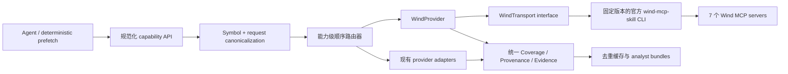

# TradingAgents 接入 Wind AIFin Market 的 A 股数据源方案（历史计划）

- **Status: Archived Plan（冻结于 2026-08-12）**
- **Do not use this document as evidence of current implementation behavior.**
- 本文保留 Wind 接入的原始调研、架构决策与分阶段实施方案。当前真实支持的 Wind 能力、配置、路由与限制见 [docs/integrations/wind.md](../../integrations/wind.md)；当前文档入口以 [docs/README.md](../../README.md) 为准。
- 本文件中的“尚未实现”“需要确认”“建议新增”等时效性描述只代表 2026-08-12 调研时的判断，不代表当前实现状态。

> 状态：Implemented for adjusted-price routing; remaining Wind capabilities stay gated by contract verification
> 调研日期：2026-08-12（Asia/Shanghai）  
> 适用范围：A 股个股、指数/板块、中国宏观与行业 EDB、公告、财经新闻，以及与这些数据直接相关的基本面、估值、事件和风险指标  
> 本文性质：架构决策与实施/测试计划，不包含生产密钥，不代表已完成实时数据验收

本轮已完成的实现范围：

- `stock_data.get_stock_kline` 已按本机 `wind-mcp-skill` 2.0.1 的 `stock.md` 契约接入 `get_adjusted_price_history`。
- 生产请求固定为日线、前复权：`period=1d`、`aftype=0`，并显式记录 `price_basis=qfq`、实际日期窗口和 provenance。
- 默认链已更新为 `Wind → Tushare → AKShare → yfinance → Alpha Vantage`；原始 `mootdx` 不进入复权链。
- Wind 财务报表、公司新闻/事件仍未接入生产链，必须分别完成字段、报告期、证据类型和覆盖契约验收后再实施。


结论不是把 Wind 统一放在所有数据源的第一位或最后一位，而是按“能力粒度”决定优先级：

- **Wind 应作为第一选择**：指数/板块、指数估值与基本面、中国宏观及行业 EDB、当前缺失的股票风险指标，以及通过语义检索补齐公告/新闻的场景。
- **Wind 应作为第二选择或故障备份**：A 股原始 OHLCV。现有 mootdx 低成本、低延迟且已经是稳定主路径，没必要为了“接入 Wind”而替换它。
- **Wind 应先影子验证、再决定是否升为第一选择**：复权行情、财务报表、公司基本面、估值、股东和公司事件。这些能力与现有 Tushare、AKShare、Tencent、mootdx 有重叠，必须先完成字段、单位、报告期、复权口径和覆盖率对账。
- **Wind 不应进入自动降级链**：`analytics_data.get_financial_data`。它只适合专用工具无法表达的跨实体聚合，不应替代行情、K 线、指数或宏观专用接口，也不应成为“万能最后一跳”。
- **继续保留现有来源**：本地技术指标计算、市场级涨停/跌停池、互动易、iWenCai、ETF 期权、市场热点等没有被 Wind 当前专用契约以同等粒度覆盖的能力。

目标架构是“**一个规范化能力只执行一条串行主备链**”。正常成功时只调用一个来源；只有主源出现可降级失败时才调用下一个来源。跨源对账只在测试、灰度或显式一致性检查模式中进行，不能成为每次研究运行的默认行为。

## 2. 调研依据与证据边界

### 2.1 Wind 官方公开页面

- [AIFin Market 首页](https://aifinmarket.wind.com.cn/#/home)：产品定位为面向 AI Agent 的金融能力市场；官方页面说明底层数据覆盖股票、基金、指数、债券和宏观，并基于 MCP 接入。
- [AIFin Market 操作手册](https://aifinmarket.wind.com.cn/#/docs)：提供一键安装与手工接入两种方式，要求从个人中心取得密钥，并明确建议通过环境变量保存凭据、定期轮换、限制权限、监控使用情况和使用 HTTPS。
- [AIFin Market 能力市场](https://aifinmarket.wind.com.cn/#/market)：调研时展示 7 个 MCP 服务，分别为股票、基金、指数、债券、宏观、金融文档和金融计算。
- [Wind 一键接入入口](https://aifinmarket.wind.com.cn/skill.md)：操作手册指定的 Agent 接入入口。
- 官方技能仓库：[Gitee](https://gitee.com/wind_info/wind-skills)、[GitHub](https://github.com/Wind-Information-Co-Ltd/wind-skills)。

### 2.2 本机已安装的 Wind 官方 skill 契约

本次同时核对了 `wind-mcp-skill` 2.0.1 的 `SKILL.md`、领域参考契约、工具清单、调用规则和 CLI 包装器。它比公开网页提供了更多运行时约束：

- 7 个 MCP server 类型：`stock_data`、`fund_data`、`index_data`、`bond_data`、`financial_docs`、`economic_data`、`analytics_data`。
- 默认串行，并发上限为 10；只有明确需要并发时才应提高并发。
- 股票/基金/指数最新价格指标单次最多 50 个代码。
- 成功响应可能在 `content[0].text` 中嵌套 JSON；`INVALID` 会被转换为 `null`，不能当成 0。
- EDB 的单位与量级来自响应元数据，不能凭经验换算。
- 已定义认证、单日额度、余额、QPS、并发、网络、参数、无结果、标的识别失败等稳定错误类型。
- `analytics_data` 不是行情或批量行情入口；专用工具可覆盖时不得使用它。

### 2.3 重要的不一致与证据缺口

公开能力市场与已安装 skill 之间存在可见版本差异：能力市场页面显示股票和基金各 9 个工具，而本机 `tool-manifest.json` 各列出 10 个工具（额外包含筛选工具）。因此：

1. 网页用于判断产品范围，不作为代码级工具清单的唯一事实源。
2. 运行时 `tools/list`、已安装版本的 manifest 和本项目固定的契约 fixture 才能决定可调用工具。
3. CI 必须加入“Wind 工具契约漂移检测”，不能假定网页计数、skill 文档和后端始终同步。

以下信息在公开页面中没有足够明确的数值或承诺，实施前仍需确认：具体 QPS/日额度/计费、SLA、数据延迟、历史深度、字段稳定性、密钥权限粒度、数据缓存与二次分发许可。

## 3. TradingAgents 当前数据架构审计

### 3.1 已有的优点

当前仓库已经具备适合挂载 Wind 的基础设施：

- `tradingagents/dataflows/registry.py` 集中维护能力分类、供应商、市场覆盖矩阵和方法到实现的映射。
- `tradingagents/dataflows/interface.py` 已支持显式主备链、按市场跳过不适用来源、类型化失败、来源健康状态、故障降级和 provenance。
- `tradingagents/dataflows/health.py` 的健康状态按 `(vendor, market, capability)` 隔离，不会因为一个接口故障而停用整个供应商。
- `tradingagents/dataflows/coverage.py` 已有 requested/actual window、完整性、来源、退化原因、复权口径等公共覆盖契约。
- 原始行情、复权行情、补充数据、公告和新闻已经被刻意分离，避免补充接口污染核心行情路径。
- 现有工具 bundle 会保留 route method 和 coverage，可继续承载 Wind 的来源信息。

### 3.2 当前 A 股路径

| 能力 | 当前有效路径/实现 | 主要局限 |
|---|---|---|
| 原始日线 OHLCV | mootdx → Tushare | 没有第三个研究级备份；无独立指数能力 |
| 复权行情 | Tushare → AKShare | 需继续严格区分原始与复权，不可静默回退 |
| 技术指标 | 本地基于行情计算 | 是优点，不应被远端同名指标默认替换 |
| 基本面 | Tushare → AKShare；三大报表为 Tushare → Sina | 来源分散、字段完整度和报告期口径不完全统一 |
| 实时估值 | Tencent | 覆盖集中在当前估值，历史分位与更广字段有限 |
| A 股公告 | CNINFO/交易所优先，EastMoney 备份 | 精确官方披露较强，语义检索和跨发行人召回仍可补强 |
| 公司新闻 | Tavily → EastMoney；必要时交易所公告兜底 | 新闻与公告必须继续保持不同证据类型 |
| 中国宏观 | AKShare 固定 7 组指标 | 当前 bundle 实际默认只取 GDP、CPI、PMI、货币供应、LPR；缺行业 EDB 和指标发现 |
| 指数/板块 | 没有独立的一等数据能力 | benchmark 代码仅用于反思层映射，不等于指数数据接口 |
| A 股特色数据 | EastMoney、THS、Sina、AKShare、mootdx 等 | 粒度多样，不能被一个泛化 Wind 查询粗暴替代 |

### 3.3 必须先解决的架构缺口

1. **指数不是一等能力**：当前没有 source-neutral 的指数快照、历史、档案和估值接口。
2. **中国宏观接口过窄**：现有 `get_china_macro_indicators` 是固定 allowlist，无法表达 Wind EDB 的“指标搜索 → 稳定代码 → 时间序列提取”。
3. **符号规范不同**：项目内部上海证券通常规范为 `.SS`，Wind 标准代码使用 `.SH`；指数代码与同号段股票必须显式区分，禁止猜测。
4. **bundle 并发为 3**：Wind 默认要求串行，应在 Wind transport 内单独限流，不能把全局 bundle 并发直接传给 Wind。
5. **错误冷却不够细**：当前 20/60 秒冷却适合网络和限流，但不适合“单日额度耗尽”“余额不足”“密钥失效”这类长时或人工恢复状态。
6. **本地测试缺口大**：当前 `tests/` 没有覆盖 A 股数据路由、Wind 适配、指数、EDB、错误信封和契约漂移的测试。
7. **能力文档已落后于注册表**：现有 `docs/a-share-data-capabilities.md` 只描述了部分能力，实施时必须同步更新。

## 4. Wind 能力与项目能力映射

| Wind 服务/工具族 | 可补齐的项目能力 | 重叠情况 | 建议 |
|---|---|---|---|
| `index_data`：快照、K 线、分钟、档案、技术、基本面/估值 | 指数/板块一等能力、市场宽度与 regime 的底层事实 | 当前基本缺失 | 第一优先级接入，Wind 主源 |
| `economic_data.natural_language_get_edb_data` | 中国/全球宏观、行业 EDB、指标发现与稳定代码提取 | 与 AKShare 7 个基础序列部分重叠 | Wind 主源；AKShare 只对已支持基础指标降级 |
| `stock_data.get_stock_price_indicators` / K 线 /分钟 | 当前快照和行情备份 | 与 mootdx/Tushare 重叠 | mootdx 主源；Wind 第二；Tushare 后备 |
| `stock_data.get_stock_fundamentals` | 三大报表、财务比率、估值与历史分位、行业专项指标 | 与 Tushare/AKShare/Sina/Tencent 重叠 | 先影子验证；通过后按子能力升为主源 |
| `get_stock_basicinfo` / `get_stock_equity_holders` / `get_stock_events` | 公司档案、股本股东、解禁、分红、监管与资本运作 | 与 mootdx F10、EastMoney specialty 部分重叠 | 新建规范化能力，Wind 优先；精确公共事件保留后备 |
| `get_risk_metrics` | Beta、Alpha、波动、Sharpe、VaR、最大回撤 | 当前无完整专用来源 | Wind 主源；结果标注基准、窗口和口径 |
| `financial_docs.get_company_announcements` | 公告语义搜索、跨公司/类型检索 | 与 CNINFO/交易所重叠 | 按意图分流，不做并行重复抓取 |
| `financial_docs.get_financial_news` | A 股公司/行业/政策新闻 | 与 Tavily/EastMoney 重叠 | coverage-first 配置中 Wind 主源，失败后顺序降级 |
| `stock_data.get_stock_technicals` | 远端技术/资金/形态信号 | 与本地指标、部分特色接口重叠 | 本地可确定指标继续本地算；仅请求独有指标时调用 Wind |
| `search_stocks` | 多条件选股 | 与 iWenCai 部分重叠 | 独立显式能力，不加入普通个股查询链 |
| `analytics_data.get_financial_data` | 跨实体聚合、加权、排名、复合计算 | 可能与本地计算重叠 | 仅显式 opt-in；不做自动 fallback |
| `fund_data` / `bond_data` | ETF/基金/债券研究 | 当前任务的相邻能力 | 不进入第一阶段，待 A 股个股/指数/宏观稳定后再做 |

## 5. 推荐的来源优先级

### 5.1 默认目标链

下表是完成灰度验收后的目标顺序；“阶段 1”未完成对账的能力必须先按后文灰度策略运行。

| 规范化能力 | 推荐顺序 | Wind 位置 | 决策理由 |
|---|---|---|---|
| A 股当前/原始 OHLCV | mootdx → Wind → Tushare | 第二 | 保留低延迟、低成本主源；Wind 增加研究级冗余但不重复调用 |
| A 股复权历史 | Wind → Tushare → AKShare | 第一（验收后） | 统一 qfq/hfq 与覆盖元数据；若复权口径未验收则暂放第二 |
| 当前估值/历史估值分位 | Wind → Tencent | 第一 | Wind 契约覆盖更广，Tencent 保留轻量后备 |
| 财务报表/财务比率 | Wind → Tushare → Sina/AKShare | 第一（分字段验收后） | 降低多来源拼接；报告期和单位不一致时不得合并 |
| 公司档案/股东/公司事件/风险 | Wind → 对应现有专用来源 | 第一 | Wind 覆盖完整，现有来源按精确能力保留后备 |
| 指数快照/K 线/档案/估值 | Wind → EastMoney（仅 snapshot/history 的 keyless 灾备） | 第一/初期唯一主源 | Wind 保持 premium 主源；EastMoney 只在 Wind 不可用时提供明确降级，档案/估值不混入公共 fallback |
| 中国宏观/行业 EDB | Wind → AKShare（仅受支持别名） | 第一 | Wind 提供指标发现与广覆盖，AKShare 保留基础序列灾备 |
| 全球宏观（已有 FRED 别名） | FRED → Wind EDB（显式需要时） | 第二 | FRED 对已有美国系列简单稳定，避免不必要迁移 |
| 精确官方公告 | CNINFO → 交易所 → Wind | 最后 | 法定披露原站优先，Wind 用于补缺而不是改变证据等级 |
| 公告语义检索/跨公司检索 | Wind → CNINFO → 交易所 | 第一 | 这是 Wind 文档检索的优势场景 |
| A 股财经新闻 | Wind → Tavily → EastMoney | 第一 | coverage-first 默认；仍保持新闻和公告分离 |
| 本地可计算技术指标 | 本地 | 不进入链 | 避免为同一 OHLCV 再付费获取可确定计算结果 |
| 市场级特色数据 | 当前专用来源 | 通常不进入链 | Wind 的相关字段多为个股或泛化查询，不等价于市场池/榜单粒度 |
| 跨实体金融计算 | 本地确定计算 → Wind analytics（显式） | 最后且非自动 | 保证可复现、控成本、避免返回形状漂移 |

### 5.2 为什么不采用“Wind 全局第一源”

- 会重复现有 mootdx、本地技术指标和公共特色数据的成熟能力。
- 会把 API key、额度、余额、QPS 和远端可用性变成所有研究的单点依赖。
- 自然语言工具返回形状比固定 schema 更容易漂移，不适合未经规范化直接替换已有方法。
- 多个现有来源提供更高的法律/数据原始性，例如交易所与 CNINFO 公告。

### 5.3 为什么也不应“Wind 全局最后兜底”

- 指数、指数估值、EDB 指标发现和风险指标是当前明显缺口；放到最后意味着正常运行几乎不会使用这些增量能力。
- 宏观与指数若先落入不等价的公共接口，可能得到“有数据但口径不对”的假成功，反而阻止 Wind 补齐。
- Wind 在语义检索和跨实体结构化能力上的价值不是普通 HTTP 失败备胎能够替代的。

## 6. 目标架构



### 6.1 适配器边界

新增 `tradingagents/dataflows/wind_provider.py`，但不要把 Wind CLI 的路由、参数纠错和错误分类重新实现一遍。

建议分两层：

```text
WindProvider
  - 项目规范化入参/出参
  - symbol、日期、单位、coverage、provenance
  - 项目错误类型映射
  - 能力级缓存键

WindTransport (Protocol)
  - call(server_type, tool_name, params) -> WindEnvelope
  - 初始实现：WindCliTransport
  - 未来实现：WindMcpTransport（仅在 Wind 发布稳定 SDK/协议承诺后）
```

第一阶段推荐复用官方 CLI，原因是它已经处理：

- server/tool 本地合法性校验；
- K 线周期映射与参数互斥；
- SSE/JSON-RPC 兼容；
- 嵌套业务错误识别；
- `INVALID` → `null`；
- 带数据错误的部分成功警告；
- 稳定错误码、重试与 circuit-breaker 提示。

生产环境不应依赖开发机“随时自动更新”的全局 skill。应在镜像/运行环境中固定 skill 版本，启动时记录版本与 manifest 哈希；只有通过契约测试后才升级。也不应把官方 skill 源码复制进本仓库形成第二份分叉。

### 6.2 规范化能力接口

新增 source-neutral 方法，而不是直接把 MCP 工具名暴露给 Agent：

- `get_index_snapshot(index_code, as_of, fields=None)`
- `get_index_history(index_code, start_date, end_date, period="1d")`
- `get_index_profile(index_code)`
- `get_index_fundamentals(index_code, as_of, fields)`
- `search_macro_series(query)`
- `get_macro_series(series_ids, start_date, end_date)`
- `get_company_profile(symbol, as_of)`
- `get_company_holders(symbol, report_period)`
- `get_company_events(symbol, event_types, start_date, end_date)`
- `get_equity_risk_metrics(symbol, benchmark, start_date, end_date, fields)`
- `search_company_announcements(symbol, query, start_date, end_date, limit)`

保留现有公开方法作为兼容包装，但让它们委托到新能力层。例如 `get_china_macro_indicators("gdp,cpi,pmi")` 应转为稳定 EDB 代码或受控 alias 的批量请求，而不是让 Agent 每次自由改写同一句自然语言。

### 6.3 符号与指标 ID

- 项目内部 A 股继续使用当前 canonical 形式：上海 `.SS`、深圳 `.SZ`、北京 `.BJ`。
- 新增 `to_wind_symbol()`：仅把已经明确识别为上海市场的 `.SS` 转为 `.SH`；不得仅靠 6 位代码猜测指数/股票。
- 指数建立独立 registry，例如 `CSI300 -> 000300.SH`、`SSE_COMPOSITE -> 000001.SH`，并保留显示名、市场、指数类型和 benchmark 用途。
- EDB 采用“两阶段”流程：首次通过自然语言 search 得到指标元数据，经审核后把 Wind EDB code 写入 allowlist；生产取数使用 code + 明确日期，不在每次运行重新搜索。

### 6.4 返回数据规范

所有 Wind 结果进入 Agent 前必须转换为项目统一 envelope：

```json
{
  "capability": "index_history",
  "provider": "wind",
  "status": "ok",
  "as_of": "2026-08-12",
  "schema_version": "1",
  "data": [],
  "coverage": {},
  "units": {},
  "warnings": [],
  "source_meta": {
    "server_type": "index_data",
    "tool_name": "get_index_kline",
    "wind_skill_version": "2.0.1"
  }
}
```

硬规则：

- `null` 永远是缺失/不适用，不得转成 0。
- 数值单位、币种、量级、频率和报告期必须随字段保存。
- 不同报告期、复权口径、指数编制口径的数据不得横向拼成一行。
- 后端未声明完整性时，coverage 只能是 `unknown`，不能依据记录数猜测完整。
- 带 `BACKEND_ERROR_WITH_DATA` 或 `UNKNOWN_BACKEND_STATUS_WITH_DATA` 的响应标为 partial，并保留可用数据和警告。

## 7. 去重与非冗余规则

### 7.1 一次语义请求只走一条链

缓存/去重键至少包括：

```text
capability
canonical instrument/series IDs
requested fields
date/report-period window
frequency
adjustment basis
currency/unit policy
as-of bucket
```

供应商名称不进入第一层语义键；这样同一请求主源失败后进入后备时，仍属于同一个逻辑请求和一条 provenance 链。

### 7.2 禁止的重复模式

- 正常模式下同时调用 Wind、Tushare、AKShare 再选“看起来最合理”的结果。
- 已经取得 OHLCV 后，再调用 Wind 获取 MACD/RSI 等本地可确定计算指标。
- 使用 Wind 文档新闻和 Wind 公告同时回答同一个“官方披露”请求。
- 先调用专用指数/EDB 工具，又调用 `analytics_data` 获取同一结果。
- 每次宏观取数都先做自然语言指标搜索。
- 因为一个字段缺失而重拉整张大表；应按缺失字段发起最小补取。

### 7.3 允许的跨源调用

- 主源明确失败后按顺序 fallback。
- 灰度期 shadow compare；结果不得同时进入 Agent 上下文。
- 用户显式要求事实核验或一致性检查。
- 规范化结果缺少必需字段，且第二来源只补缺失字段；输出必须标注 composite sources。

## 8. 错误、限流与熔断策略

| Wind 错误 | 项目处理 | 是否 fallback | 健康状态 |
|---|---|---|---|
| `AUTH_ERROR` | 明确报配置/密钥问题；不得换 Wind 工具绕过 | 多供应商链可降级；Wind-only 配置应失败 | 人工恢复锁定，不做短时重试 |
| `DAILY_LIMIT_ERROR` | 停止当日 Wind 新请求 | 是 | 在官方确认重置时区前保持锁定，不猜恢复时间 |
| `BALANCE_ERROR` | 停止 Wind 请求并提示余额问题 | 是 | 人工恢复锁定 |
| `RATE_LIMIT_ERROR` | transport 按官方信封等待并原样重试一次，仍失败则降级 | 是 | 短时冷却，禁止路由器再叠加重试 |
| `CONCURRENCY_LIMIT_ERROR` | 停止同批新增请求，恢复串行 | 是 | 立刻把 Wind semaphore 降为 1 |
| `NETWORK_ERROR` / `TEMPORARILY_UNAVAILABLE` | transport 完成一次有界同请求重试后降级 | 是 | 能力级短时冷却，避免 CLI 与路由器双重放大 |
| `NO_RESULTS` | 只允许一次受控缩窄/改写 | 视能力而定 | 不把“无结果”解释为“事件不存在” |
| 参数/路由错误 | 测试或代码缺陷，按 error details 修正 | 否，不应静默换源掩盖 | 不熔断供应商 |
| `MARKET_TARGET_NOT_FOUND` | 要求准确全称或 Wind code | 否 | 不猜后缀 |
| 带数据的 warning | 保留数据，标 partial | 通常否 | 记录 warning 指标 |

需要扩展当前 `VendorHealthRegistry`：支持 `retry_at` 之外的 `manual_recovery` 和 `quota_period` 状态，并把状态持久化到 run/session 范围，避免每个 Agent 线程重复撞击已知不可用的 Wind 服务。

## 9. 配置与安全

建议新增配置：

```yaml
wind:
  enabled: false
  transport: cli
  cli_path: null
  pinned_skill_version: "2.0.1"
  max_concurrency: 1
  request_timeout_seconds: 610
  shadow_mode: false
  contract_drift_policy: fail_closed
```

供应商链仍放入现有 `data_vendors` / `tool_vendors`，但只对实际注册了 Wind 实现的方法生效。

安全规则：

- 只在 `.env.example` 中写 `WIND_API_KEY=` 占位符，不在 JSON 示例、测试 fixture、日志或报告中写真实值。
- 生产环境通过 secret manager 注入环境变量；容器中不得存在开发者个人的全局 Wind 配置。
- 官方 CLI 当前读取顺序是“用户全局配置 → skill 本地配置 → 环境变量”。生产镜像必须保证前两处不存在陈旧凭据，或在上游 CLI 支持显式 key source 后再允许多租户运行。
- subprocess 使用参数数组，不使用 `shell=True`，不把 key 放进命令行参数。
- 日志只记录 provider、server/tool、错误码、延迟、行数、coverage 和不可逆 key fingerprint；不记录请求头、Bearer token 或原始后端错误中的敏感片段。
- 原始 Wind 响应进入持久化证据前要执行现有 redaction，并确认数据授权允许缓存。

## 10. 缓存、时效与成本控制

建议按数据性质设置不同 TTL，而不是一个全局缓存：

| 数据 | 建议策略 |
|---|---|
| 分钟行情/最新快照 | 交易时段 15–60 秒；收盘后按交易日冻结 |
| 日线 K 线 | 当日收盘前短 TTL；历史已结束区间可长期缓存 |
| 财务报表/股东 | 以报告期 + 公告日期为键，事件驱动失效 |
| 指数档案 | 7–30 天，调仓/规则变更时失效 |
| 指数估值 | 日级 |
| EDB | 按指标发布频率；保存 release date、observation date 和 revision/as-of |
| 公告 | 文档 ID/URL 永久去重，正文按授权缓存 |
| 新闻 | 15–60 分钟，按 canonical URL/标题/发布时间去重 |

为控制额度：

- 默认 Wind 并发为 1。
- 多代码价格快照使用 Wind 官方单次最多 50 个代码的批量接口。
- 宽字段查询按“代码数 × 字段数”主动缩小批次。
- 在一次 run 内共享 request cache，多个 analyst 不得重复拉相同指数、宏观或公司基本面。
- 先执行确定性 prefetch，再把结果提供给 Agent，避免 LLM 自由生成重复工具调用。

## 11. 实施计划

### 阶段 0：决策门与契约固化（1–2 天）

- 向 Wind 确认第 15 节的阻塞性问题。
- 记录当前 `wind-mcp-skill` 版本、manifest 哈希和 `tools/list` schema。
- 建立脱敏的成功/失败 fixture，不在这一阶段改变默认路由。
- 明确生产授权是否允许缓存、持久化 evidence 和多 Agent 共享结果。

交付物：契约快照、字段字典、错误矩阵、Go/No-Go 记录。

### 阶段 1：最小 transport 与唯一增量能力（3–5 天）

- 新建 `wind_provider.py` 与 `WindTransport` / `WindCliTransport`。
- 注册 `wind` 到 `VENDOR_LIST` 和 `VENDOR_MARKETS`，市场范围按每个工具真实能力声明。
- 实现 `.SS` → `.SH` 的显式转换和指数 registry。
- 首批只接：指数快照/K 线/档案/基本面、EDB search/fetch、股票风险指标。
- 接入 coverage、provenance、redaction、能力级 semaphore 和错误映射。
- 新增 source-neutral Agent tools；不要直接暴露任意 `server_type/tool_name/question` 执行入口。

交付物：不改变现有 OHLCV/财务默认路径的可选 Wind 能力。

### 阶段 2：重叠能力影子对账（3–7 个交易日）

- 选取不同板块、交易所、ST/停牌/次新/金融行业等代表性 A 股。
- 对账复权行情、财务报表、估值、股东、事件和新闻。
- shadow 结果只写审计工件，不进入 Agent prompt，不影响交易结论。
- 统计覆盖率、字段缺失、延迟、错误率、单位冲突、报告期冲突和额度消耗。

交付物：每个子能力独立的“升主源/保留后备/不接入”决定。

### 阶段 3：按能力切换默认链（2–3 天）

- 指数和 EDB 默认启用 Wind。
- 通过验收的基本面/估值/复权子能力把 Wind 提升到第一位。
- 原始 OHLCV 保持 mootdx 第一，Wind 第二。
- A 股财经新闻按 coverage-first 配置切为 Wind 第一；官方公告仍保持原站优先。
- 加入 feature flag 和一键回滚到原有链的配置。

### 阶段 4：文档、运维与后续扩展

- 更新 `README.md`、`.env.example`、`tradingagents.config.example.json` 和 `docs/a-share-data-capabilities.md`。
- 增加 Wind preflight：版本、CLI 可执行、契约哈希、认证可用性、额度错误状态。
- 建立 dashboard/日志告警。
- A 股稳定后再评估 `fund_data`（ETF/基金）和 `bond_data`，不要与第一阶段混做。

## 12. 预计代码变更

| 文件 | 变更 |
|---|---|
| `tradingagents/dataflows/wind_provider.py` | 新增 transport、响应解析、规范化、coverage 和错误类型映射 |
| `tradingagents/dataflows/registry.py` | 注册 `wind`、指数/EDB/风险等能力与 market matrix |
| `tradingagents/dataflows/router.py` | 识别指数和新的非 ticker 中国宏观能力；避免把指数当股票 |
| `tradingagents/dataflows/health.py` | 增加人工恢复/额度周期状态 |
| `tradingagents/dataflows/vendor_errors.py` | 映射 Wind 稳定错误码，避免双重重试 |
| `tradingagents/dataflows/ticker_utils.py` | 新增经验证的 `to_wind_symbol`，不改变内部 canonical symbol |
| `tradingagents/default_config.py` | 增加 Wind feature flags 和能力级默认链 |
| `tradingagents/agents/utils/index_data_tools.py` | 新增受控指数工具 |
| `tradingagents/agents/utils/macro_data_tools.py` | 增加 EDB search/fetch，保留 FRED 接口 |
| `tradingagents/agents/utils/data_meta_tools.py` | 将指数/中国宏观加入 allowlisted bundle；共享 run cache |
| `tradingagents/observability/*` | 记录 Wind 版本、tool、错误码、coverage，不记录 key |
| `tests/fixtures/wind/*` | 脱敏契约 fixture |
| `tests/test_wind_*.py` | 单元、契约、路由、降级、安全和 live smoke 测试 |

## 13. 测试计划

### 13.1 无网络单元测试（每次 CI 必跑）

1. **命令与参数安全**
   - subprocess 不使用 shell；路径含空格时仍能运行。
   - 参数 JSON 不经过字符串拼接。
   - key 不出现在 argv、日志、异常和 snapshot。

2. **符号与日期**
   - `600519.SS`/`600519.SH` 的股票场景、`000300.SH` 指数场景、`.SZ`、`.BJ`。
   - 拒绝歧义 `000001`，除非调用方明确股票/指数和市场。
   - EDB `beginDate/endDate` 与 `observation` 互斥。

3. **成功解析**
   - 纯 JSON、SSE、`content[0].text` 嵌套 JSON。
   - 多数据块全部保留。
   - `INVALID`/`null`、单位、量级、币种、频率、warnings。

4. **错误映射**
   - AUTH、日额度、余额、QPS、并发、网络、无结果、参数、NER、后端带数据错误。
   - 验证哪些错误允许 fallback，哪些必须 fail closed。
   - 验证 CLI 已重试后项目层不再形成重试风暴。

5. **路由和去重**
   - 主源成功时后备调用次数为 0。
   - 主源可恢复失败时只调用下一个来源一次。
   - 同一 run 中相同语义请求只执行一次。
   - `analytics_data` 永不被自动选择为行情/指数/EDB fallback。

6. **coverage/provenance**
   - 未声明完整性时为 `unknown`。
   - 复权结果必须携带 `price_basis`、`adjustment_source`、`adjustment_verified`。
   - composite 结果逐字段保留来源，不能伪装成单一来源。

### 13.2 契约测试

- 对 7 个 server 的 `tools/list` 保存 schema hash；PR 中升级 skill 时生成可读 diff。
- 网站工具数量只做告警，不做代码断言；runtime schema 漂移默认 fail closed。
- 用脱敏 fixture 检查旧响应仍可解析，新字段不会被静默丢弃。
- 验证 skill 版本、manifest 和 call-rules 三者一致。

### 13.3 有密钥的 live smoke（手动/受保护 CI）

使用最小请求集，默认串行：

1. 沪深 300 最新快照：`000300.SH`，默认字段。
2. 沪深 300 最近 5 个交易日日线。
3. 沪深 300 PE/PB/股息率或可用估值字段。
4. EDB 搜索“中国 GDP”，确认返回 code、单位、频率。
5. 用审核后的 EDB code 拉最近 10 期。
6. `600519.SH` 最新快照和一个明确报告期的少量基本面字段。
7. 一次公告检索，`top_k` 设为 1–3。
8. 一个故意不存在的指标/标的，验证类型化失败而非幻觉结果。

live smoke 不应使用宽字段、50 标的批量或 analytics 聚合。

### 13.4 跨源对账测试

| 数据 | 对账来源 | 核心断言 |
|---|---|---|
| 原始 OHLCV | mootdx、Tushare、Wind | 交易日、OHLC、成交量单位、停牌行；允许明确的供应商时点差异 |
| 复权行情 | Tushare、AKShare、Wind | 复权方向、基准日、公司行动日前后连续性，禁止拿原始价比较 |
| 财务报表 | Tushare/Sina/AKShare、Wind | 报告期、公告日、合并口径、币种、单位、审计/追溯调整 |
| 估值 | Tencent、Wind | 时点、总/流通市值口径、PE 分母、亏损时 null/负值语义 |
| 基础宏观 | AKShare、Wind EDB | 指标定义、地区、季调、频率、单位、发布日期和修订值 |
| 公告 | CNINFO/交易所、Wind | 文档标题、发行人、公告日、文档类型、原文身份，不比较搜索排序 |

跨源数值不一致时先归因口径，不使用“多数投票”。

### 13.5 故障与负载测试

- 无 key、无效 key、余额不足、日额度耗尽。
- 429、并发超限、DNS/连接失败、5xx、超时、SSE 截断、非 JSON 文本。
- 3 个 analyst 同时请求 Wind 时，transport 仍保持并发 1。
- 50 个代码单批成功，51 个代码被稳定拆成两批。
- shadow mode 不影响主结果，即使 Wind 完全不可用。
- circuit breaker 激活后同一能力不再重复调用；其它 Wind 能力仍可运行。

### 13.6 端到端研究回归

- A 股个股研究在 Wind 关闭时与当前行为保持兼容。
- Wind 开启后，指数/宏观证据出现在明确的 evidence ref 中。
- Agent 不把公告当新闻，也不把 `NO_RESULTS` 解释为“没有风险/事件”。
- Wind warning、coverage unknown、单位未知会进入最终限制说明。
- 相同宏观/指数数据不会被 market/news/fundamentals analyst 各拉一次。

## 14. 上线验收标准

### 14.1 功能门槛

- 指数快照、历史、档案、估值和 EDB 均有 source-neutral 接口。
- 所有 Wind 数据都有 provider、tool、as-of、单位/量级、coverage 和 provenance。
- Wind 完全关闭或不可用时，原有 A 股主路径仍可工作。
- `analytics_data` 未进入任何自动主备链。

### 14.2 质量门槛

- 代表性样本中无未解释的日期、单位、复权或报告期冲突。
- 主源成功场景的重复供应商调用率为 0。
- 跨 analyst 的 run 内语义缓存命中可观测。
- fixture 中 key 泄漏扫描为 0。
- 契约漂移能在 CI 中被发现并 fail closed。

### 14.3 稳定性门槛

- 连续 3–7 个交易日 shadow 运行没有造成现有结果回归。
- Wind p95 延迟、成功率和额度消耗满足实际预算；阈值需在取得套餐信息后填写。
- 故障注入中不会出现重试风暴、并发扩散或整个供应商全局熔断。

### 14.4 回滚

- 单个配置开关禁用 Wind。
- 每个能力可独立移除 Wind，而不是只能全局关闭。
- 关闭后不需要迁移缓存格式或修改 Agent prompt。
- 保留最近一个通过测试的 skill 版本和 manifest fixture。

## 15. 实施前需要确认的问题

以下问题不阻止本文给出架构方向，但会阻止生产默认启用：

1. 当前账号/套餐的日额度、QPS、并发上限、单次最大响应和计费单位是什么？
2. 额度重置使用哪个时区？`DAILY_LIMIT_ERROR` 的准确恢复时间是什么？
3. 是否有测试 key/沙箱，以及 CI smoke 是否允许固定的小额每日调用？
4. 原始响应是否允许在本项目的 cache、evidence ledger 和测试 fixture 中持久化？允许保存多久？
5. 多 Agent/多用户共享同一 key 与缓存是否符合许可？是否限制二次展示或分发？
6. 是否提供 SLA、状态页、版本发布记录和 schema 变更提前通知？
7. `tools/list`、skill manifest 与市场页面计数不一致时，哪个是正式契约？
8. 股票/指数 K 线的 `aftype=0/1` 在每个资产类别中的精确定义是什么？指数 K 线为何暴露复权参数？
9. 财务与估值字段的单位、币种、报告期、合并口径、TTM/静态/动态定义和修订规则是否有字段字典？
10. EDB 是否返回 release date、observation date、revision vintage 和季调标记？
11. 公告/新闻返回的是全文、片段还是链接？文档 ID 是否长期稳定？
12. 官方 CLI 是否可提供“环境变量优先”或显式 key source，避免全局旧配置覆盖生产注入 key？

## 16. 最终决策

采用“**Wind 作为能力级高质量主源 + 现有来源作为低成本/原始性/特色能力补充**”的混合策略：

- 立即优先建设指数和 EDB，因为这是最大净新增价值。
- 不替换 mootdx 原始行情主路径。
- 对基本面、估值、复权和公司数据先影子对账，再逐项升主源。
- 保持官方公告原站优先，语义公告检索 Wind 优先。
- 保持本地确定性计算优先，Wind analytics 只显式使用。
- 用串行、缓存、能力级熔断和单链 fallback 达成鲁棒性；不用默认多源并行换取表面上的“完整”。

这套方案能在不破坏现有 A 股主路径的前提下，补上指数、宏观/行业 EDB、风险和高质量结构化数据，同时把重复取数、额度消耗、来源冲突和 Agent 幻觉控制在明确边界内。
